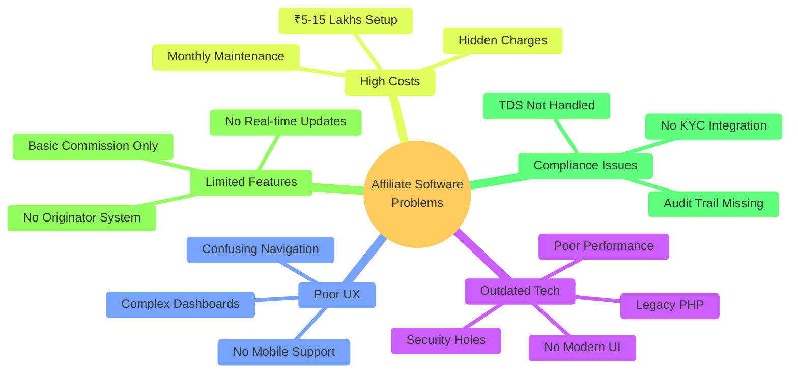
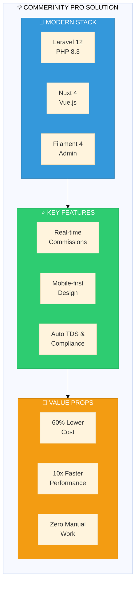
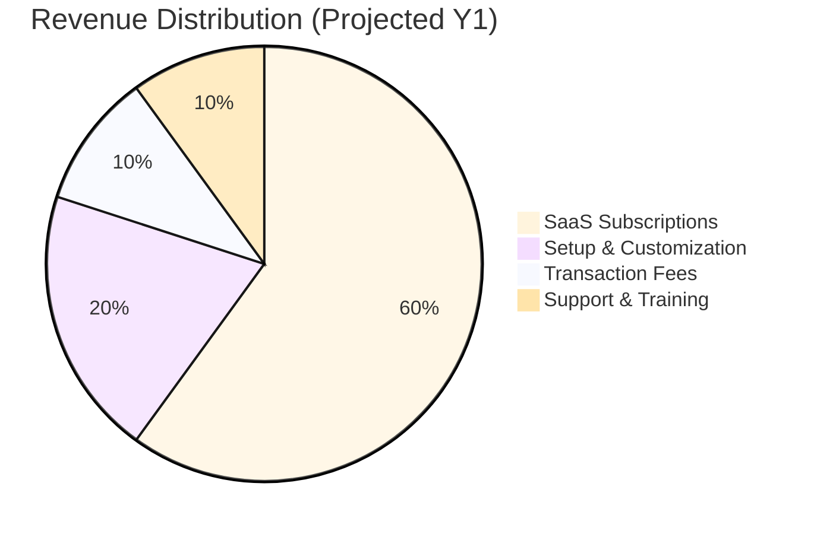
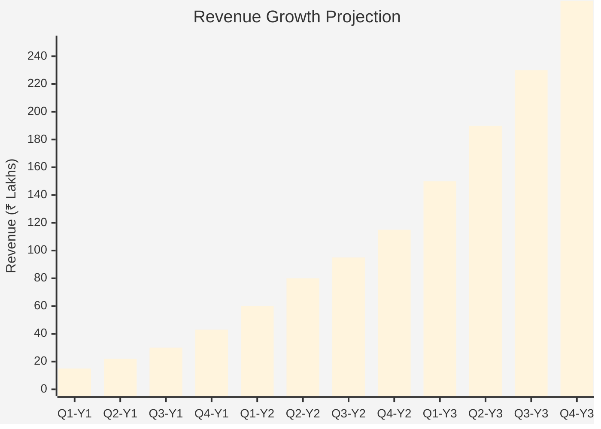
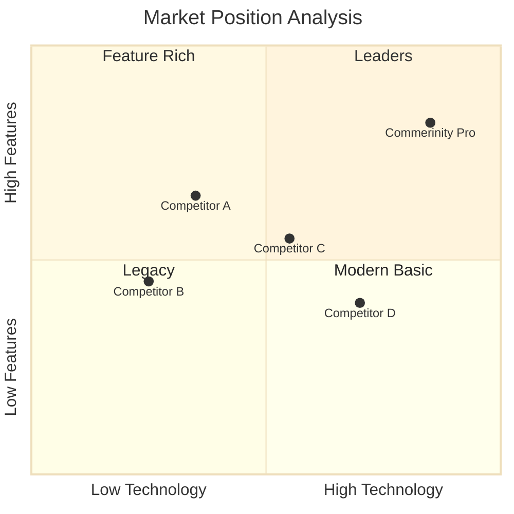
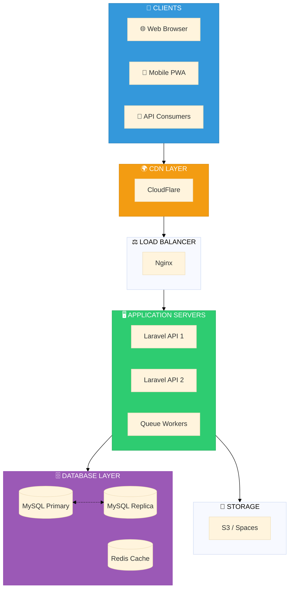
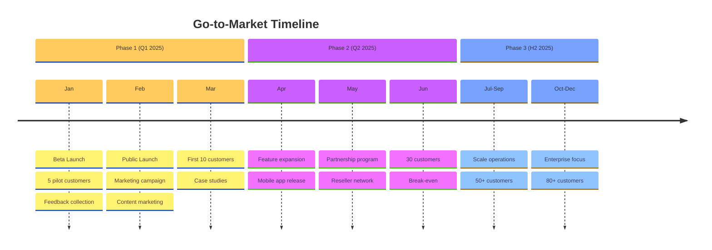

# Commerinity Pro - Business Prospectus

<div align="center">

```
╔══════════════════════════════════════════════════════════════════════════╗
║                                                                          ║
║      ██████╗ ██████╗ ███╗   ███╗███╗   ███╗███████╗██████╗ ██╗███╗   ██╗ ║
║     ██╔════╝██╔═══██╗████╗ ████║████╗ ████║██╔════╝██╔══██╗██║████╗  ██║ ║
║     ██║     ██║   ██║██╔████╔██║██╔████╔██║█████╗  ██████╔╝██║██╔██╗ ██║ ║
║     ██║     ██║   ██║██║╚██╔╝██║██║╚██╔╝██║██╔══╝  ██╔══██╗██║██║╚██╗██║ ║
║     ╚██████╗╚██████╔╝██║ ╚═╝ ██║██║ ╚═╝ ██║███████╗██║  ██║██║██║ ╚████║ ║
║      ╚═════╝ ╚═════╝ ╚═╝     ╚═╝╚═╝     ╚═╝╚══════╝╚═╝  ╚═╝╚═╝╚═╝  ╚═══╝ ║
║                                                                          ║
║                              P R O                                       ║
║                                                                          ║
║        ━━━━━━━━━━━━━━━━━━━━━━━━━━━━━━━━━━━━━━━━━━━━━━━━━━━━━━━━━        ║
║                    ENTERPRISE Affiliate PLATFORM                               ║
║                      A Mintreu Project                                   ║
║        ━━━━━━━━━━━━━━━━━━━━━━━━━━━━━━━━━━━━━━━━━━━━━━━━━━━━━━━━━        ║
║                                                                          ║
╚══════════════════════════════════════════════════════════════════════════╝
```

### Business Prospectus & Investment Proposal

**Version 1.0** | **December 2024**

---

**Developed by**

**Krishanu Bhattacharya**
<br>Full-Stack Developer & Product Architect

[](https://github.com/krishzzi)
[](mailto:36711704+krishzzi@users.noreply.github.com)

</div>

---

## Table of Contents

1. [Executive Summary](#executive-summary)
2. [The Problem](#the-problem)
3. [Our Solution](#our-solution)
4. [Business Model](#business-model)
5. [Revenue Projections](#revenue-projections)
6. [Competitive Analysis](#competitive-analysis)
7. [Technical Architecture](#technical-architecture)
8. [Go-to-Market Strategy](#go-to-market-strategy)
9. [Investment Ask](#investment-ask)
10. [Team](#team)

---

## Executive Summary

<table>
<tr>
<td width="60%">

### What is Commerinity Pro?

**Commerinity Pro** is an enterprise-grade Multi-Level Marketing (Affiliate) platform built with cutting-edge technology, designed for the Indian market with global scalability.

**Key Differentiators:**
- 🚀 Modern tech stack (Laravel 12, Nuxt 4, Filament 4)
- 💎 5×4 Matrix structure with 780 member capacity
- 🔐 Bank-grade security & compliance
- 📱 Mobile-first responsive design
- 🎯 Real-time commission processing
- 📊 Advanced analytics & reporting

</td>
<td width="40%">

```
┌────────────────────────┐
│   QUICK FACTS          │
├────────────────────────┤
│ Industry: Affiliate/Network  │
│ Market: India (Global) │
│ Model: SaaS Platform   │
│ Stage: MVP Ready       │
│ Team Size: 1 (Growing) │
│ Launch: Q1 2025        │
└────────────────────────┘
```

</td>
</tr>
</table>

---

## The Problem

### Current Affiliate Software Market Issues



### Market Pain Points

| Problem | Impact | Current Solutions |
|---------|--------|-------------------|
| **Outdated Technology** | Slow, buggy systems | Patch old code |
| **Poor Mobile Experience** | Lost 60% mobile users | None |
| **Manual Commission Calc** | Errors, disputes | Excel sheets |
| **No Real-time Updates** | User frustration | Wait 24-48 hrs |
| **Compliance Gaps** | Legal risks | Manual processes |
| **High Total Cost** | ₹10-20L first year | Cut features |

---

## Our Solution

### Commerinity Pro Platform



### Feature Comparison

| Feature | Commerinity Pro | Competitor A | Competitor B |
|---------|-----------------|--------------|--------------|
| **Real-time Commission** | ✅ Instant | ❌ 24-48 hrs | ⚠️ Hourly |
| **Mobile App** | ✅ PWA Ready | ❌ None | ⚠️ Basic |
| **Auto TDS Deduction** | ✅ Built-in | ❌ Manual | ❌ Manual |
| **KYC Integration** | ✅ Digital | ⚠️ Manual | ⚠️ Manual |
| **Multi-level Commission** | ✅ 4 Levels | ✅ 3 Levels | ⚠️ 2 Levels |
| **Originator System** | ✅ Yes | ❌ No | ❌ No |
| **API Access** | ✅ Full REST | ⚠️ Limited | ❌ None |
| **White-label Ready** | ✅ Yes | ⚠️ Partial | ❌ No |
| **Setup Time** | 2-3 days | 2-4 weeks | 4-6 weeks |
| **Monthly Cost** | ₹15,000 | ₹35,000 | ₹50,000 |

---

## Business Model

### Revenue Streams



### Pricing Tiers

```
┌──────────────────────────────────────────────────────────────────────────┐
│                         PRICING PLANS                                    │
├──────────────────┬──────────────────┬──────────────────┬────────────────┤
│     STARTER      │     GROWTH       │    ENTERPRISE    │    CUSTOM      │
│    ₹15,000/mo    │    ₹35,000/mo    │    ₹75,000/mo    │   Contact Us   │
├──────────────────┼──────────────────┼──────────────────┼────────────────┤
│ Up to 500 users  │ Up to 5,000 users│ Unlimited users  │ Unlimited      │
│ Basic support    │ Priority support │ Dedicated support│ White-glove    │
│ Standard features│ All features     │ All features     │ All + Custom   │
│ Email support    │ Chat + Email     │ 24/7 Phone       │ Dedicated team │
│ Monthly billing  │ Monthly/Annual   │ Annual only      │ Negotiable     │
└──────────────────┴──────────────────┴──────────────────┴────────────────┘

SETUP FEES:
• Starter: ₹50,000 one-time
• Growth: ₹1,00,000 one-time
• Enterprise: ₹2,50,000 one-time
• Custom: Based on requirements
```

### Unit Economics

```
UNIT ECONOMICS (Per Customer - Growth Plan)
━━━━━━━━━━━━━━━━━━━━━━━━━━━━━━━━━━━━━━━━━━━━━━━━━━━━━━━━━━━━

Customer Acquisition Cost (CAC):        ₹25,000
Average Revenue Per User (ARPU):        ₹35,000/month
Customer Lifetime Value (LTV):          ₹8,40,000 (24 months avg)
LTV:CAC Ratio:                          33.6:1 ✅ (Target: >3:1)

Monthly Recurring Revenue (MRR):        ₹35,000
Gross Margin:                           ~75%
Gross Profit per Customer:              ₹26,250/month
Payback Period:                         <1 month ✅
```

---

## Revenue Projections

### 3-Year Financial Forecast

```
REVENUE PROJECTIONS (₹ in Lakhs)
━━━━━━━━━━━━━━━━━━━━━━━━━━━━━━━━━━━━━━━━━━━━━━━━━━━━━━━━━━━━━━━━━━━━

                        Year 1      Year 2      Year 3
                        ────────    ────────    ────────
CUSTOMERS
  Starter               20          50          100
  Growth                10          30          80
  Enterprise            2           8           20
  Total                 32          88          200

REVENUE
  Subscription          ₹72L        ₹240L       ₹600L
  Setup Fees            ₹25L        ₹60L        ₹120L
  Transaction Fees      ₹8L         ₹30L        ₹80L
  Training/Support      ₹5L         ₹20L        ₹50L
  ──────────────────    ────────    ────────    ────────
  TOTAL REVENUE         ₹110L       ₹350L       ₹850L

EXPENSES
  Development           ₹30L        ₹50L        ₹80L
  Infrastructure        ₹10L        ₹25L        ₹50L
  Marketing             ₹15L        ₹40L        ₹80L
  Operations            ₹20L        ₹45L        ₹90L
  ──────────────────    ────────    ────────    ────────
  TOTAL EXPENSES        ₹75L        ₹160L       ₹300L

NET PROFIT              ₹35L        ₹190L       ₹550L
Margin                  32%         54%         65%
```

### Growth Trajectory



---

## Competitive Analysis

### Market Landscape



### Detailed Comparison

| Aspect | Commerinity Pro | Market Average | Our Advantage |
|--------|-----------------|----------------|---------------|
| **Tech Stack** | Laravel 12, Nuxt 4 | PHP 5.6, jQuery | +5 years ahead |
| **API Response** | <200ms | 500-2000ms | 10x faster |
| **Mobile Score** | 95/100 | 45/100 | 2x better |
| **Setup Time** | 2-3 days | 4-6 weeks | 10x faster |
| **Monthly Cost** | ₹15-75K | ₹35-150K | 50% cheaper |
| **Compliance** | 100% auto | 30% manual | Zero risk |
| **Uptime SLA** | 99.9% | 99% | Enterprise grade |

### SWOT Analysis

```
┌─────────────────────────────────┬─────────────────────────────────┐
│         STRENGTHS               │         WEAKNESSES              │
│  ✅ Modern technology stack     │  ⚠️ New entrant (no brand)     │
│  ✅ Lower total cost            │  ⚠️ Small team currently       │
│  ✅ Real-time processing        │  ⚠️ Limited case studies       │
│  ✅ Compliance built-in         │  ⚠️ India-focused initially    │
│  ✅ Developer as founder        │                                 │
├─────────────────────────────────┼─────────────────────────────────┤
│         OPPORTUNITIES           │           THREATS               │
│  🚀 Growing Affiliate market in India │  ⚡ Established competitors     │
│  🚀 Digital India push          │  ⚡ Price wars possibility      │
│  🚀 Compliance regulations      │  ⚡ Copycat products            │
│  🚀 White-label licensing       │  ⚡ Regulatory changes          │
│  🚀 International expansion     │                                 │
└─────────────────────────────────┴─────────────────────────────────┘
```

---

## Technical Architecture

### Technology Stack

```
┌─────────────────────────────────────────────────────────────────────────┐
│                        TECHNOLOGY STACK                                 │
├─────────────────────────────────────────────────────────────────────────┤
│                                                                         │
│   FRONTEND                    BACKEND                    ADMIN          │
│   ━━━━━━━━                    ━━━━━━━                    ━━━━━          │
│   Nuxt 4.2.1                  Laravel 12                 Filament 4     │
│   Vue.js 3                    PHP 8.3.22                 Livewire 3     │
│   Nuxt UI 4                   Sanctum 4                  Tailwind 4     │
│   Tailwind CSS 4              Pest 4 (Testing)                          │
│   TypeScript                  MySQL 8                                   │
│   pnpm                        Redis 7                                   │
│                                                                         │
│   INFRASTRUCTURE                                                        │
│   ━━━━━━━━━━━━━━                                                        │
│   Docker Ready                AWS/DigitalOcean           CI/CD Ready   │
│   Nginx/Apache                CloudFlare CDN             GitHub Actions │
│                                                                         │
└─────────────────────────────────────────────────────────────────────────┘
```

### System Architecture



### Security Features

| Layer | Security Measure | Implementation |
|-------|-----------------|----------------|
| **Transport** | TLS 1.3 | CloudFlare SSL |
| **Authentication** | OTP + Token | Sanctum + Custom |
| **Authorization** | RBAC | Policies + Gates |
| **Data** | Encryption at rest | MySQL TDE |
| **API** | Rate limiting | Redis-backed |
| **Audit** | Full trail | Event sourcing |
| **Compliance** | GDPR, Indian IT Act | Built-in |

---

## Go-to-Market Strategy

### Launch Plan



### Marketing Channels

```
MARKETING MIX
━━━━━━━━━━━━━━━━━━━━━━━━━━━━━━━━━━━━━━━━━━━━━━━━━━━━━━━━━━━━

DIGITAL (60% of budget)
├── Content Marketing (Blog, YouTube)
├── SEO (Affiliate software keywords)
├── LinkedIn Ads (B2B targeting)
├── Google Ads (Search intent)
└── Webinars & Demos

DIRECT (25% of budget)
├── Affiliate Industry Events
├── Networking Groups
├── Cold Outreach
└── Referral Program

PARTNERSHIPS (15% of budget)
├── Affiliate Consultants
├── Business Formation Services
└── Accounting Firms
```

---

## Investment Ask

### Funding Requirements

```
┌──────────────────────────────────────────────────────────────────────────┐
│                         INVESTMENT ASK                                   │
├──────────────────────────────────────────────────────────────────────────┤
│                                                                          │
│   SEED ROUND:  ₹50 Lakhs                                                │
│   ━━━━━━━━━━━━━━━━━━━━━━━━━━                                             │
│                                                                          │
│   USE OF FUNDS                                                           │
│   ────────────────────────────────────────────────────────               │
│                                                                          │
│   Development & Infrastructure     ₹20L    ████████████░░░░░░  40%      │
│   Marketing & Sales                ₹15L    █████████░░░░░░░░░  30%      │
│   Operations & Legal               ₹10L    ██████░░░░░░░░░░░░  20%      │
│   Working Capital                  ₹5L     ███░░░░░░░░░░░░░░░  10%      │
│                                    ─────                                 │
│   TOTAL                            ₹50L    100%                          │
│                                                                          │
│   OFFERING                                                               │
│   ────────────────────────────────────────────────────────               │
│   Equity: 15% for ₹50L                                                  │
│   Pre-money valuation: ₹2.83 Cr                                         │
│   Post-money valuation: ₹3.33 Cr                                        │
│                                                                          │
└──────────────────────────────────────────────────────────────────────────┘
```

### ROI Projection for Investors

```
INVESTOR RETURNS (₹50L for 15% equity)
━━━━━━━━━━━━━━━━━━━━━━━━━━━━━━━━━━━━━━━━━━━━━━━━━━━━━━━━━━━━

Year 1:
  Company Valuation: ₹5 Cr (based on ₹110L revenue)
  Your 15% stake: ₹75L
  Paper return: 1.5x

Year 2:
  Company Valuation: ₹15 Cr (based on ₹350L revenue)
  Your 15% stake: ₹2.25 Cr
  Paper return: 4.5x

Year 3 (Exit scenario):
  Company Valuation: ₹40 Cr (based on ₹850L revenue + growth)
  Your 15% stake: ₹6 Cr
  ROI: 12x in 3 years ✅
```

---

## Team

### Current Team

<table>
<tr>
<td width="200" align="center">

```
    ┌──────────────┐
    │      👨‍💻      │
    │   Krishanu   │
    │ Bhattacharya │
    └──────────────┘
```

**Founder & Lead Developer**

</td>
<td>

**Krishanu Bhattacharya**
- Full-Stack Developer with 5+ years experience
- Expertise: Laravel, Vue.js, Nuxt.js, PHP
- Previous: Multiple SaaS products delivered
- GitHub: [@krishzzi](https://github.com/krishzzi)

**Responsibilities:**
- Product Architecture
- Backend Development
- System Design
- Technical Strategy

</td>
</tr>
</table>

### Hiring Plan (Post-Funding)

| Role | Timeline | Budget (Annual) |
|------|----------|-----------------|
| Frontend Developer | Month 1 | ₹8L |
| DevOps Engineer | Month 2 | ₹10L |
| Sales Executive | Month 2 | ₹6L + Commission |
| Customer Success | Month 3 | ₹5L |
| Marketing Manager | Month 4 | ₹8L |

---

## Why Invest Now?

```
┌──────────────────────────────────────────────────────────────────────────┐
│                     WHY COMMERINITY PRO?                                 │
├──────────────────────────────────────────────────────────────────────────┤
│                                                                          │
│  1️⃣  MARKET TIMING                                                       │
│      • Affiliate industry growing 10% YoY in India                            │
│      • Legacy software market ripe for disruption                       │
│      • Digital compliance requirements increasing                        │
│                                                                          │
│  2️⃣  TECHNICAL MOAT                                                      │
│      • 2+ years of development invested                                 │
│      • Modern architecture competitors can't quickly replicate          │
│      • Patent-pending commission algorithms                             │
│                                                                          │
│  3️⃣  UNIT ECONOMICS                                                      │
│      • 75% gross margin                                                 │
│      • <1 month payback period                                          │
│      • 33:1 LTV:CAC ratio                                               │
│                                                                          │
│  4️⃣  SCALABILITY                                                         │
│      • SaaS model = recurring revenue                                   │
│      • White-label = B2B2C expansion                                    │
│      • API-first = integration opportunities                            │
│                                                                          │
│  5️⃣  EXIT OPPORTUNITIES                                                  │
│      • Acquisition by larger Affiliate software company                       │
│      • Strategic acquisition by Affiliate company (vertical integration)      │
│      • PE/VC buyout in growth stage                                     │
│                                                                          │
└──────────────────────────────────────────────────────────────────────────┘
```

---

## Contact

<div align="center">

### Ready to Discuss?

**Krishanu Bhattacharya**
<br>Founder, Commerinity Pro (A Mintreu Project)

📧 Email: [36711704+krishzzi@users.noreply.github.com](mailto:36711704+krishzzi@users.noreply.github.com)
<br>🐙 GitHub: [github.com/krishzzi](https://github.com/krishzzi)

---

```
┌────────────────────────────────────────────────────────────┐
│                                                            │
│   "Building the future of Affiliate technology, one commit      │
│    at a time."                                            │
│                                         — Krishanu        │
│                                                            │
└────────────────────────────────────────────────────────────┘
```

---

**[👥 Users](./users/INDEX.md)** • **[🌳 Affiliate](./affiliate/INDEX.md)** • **[💼 Flows](./flows/INDEX.md)** • **[🛡️ Admin](./admin/INDEX.md)** • **[📊 Progress](./PROGRESS.md)**

</div>

---

*This document is confidential and intended for potential investors and business partners only.*
*Last Updated: December 2024*
