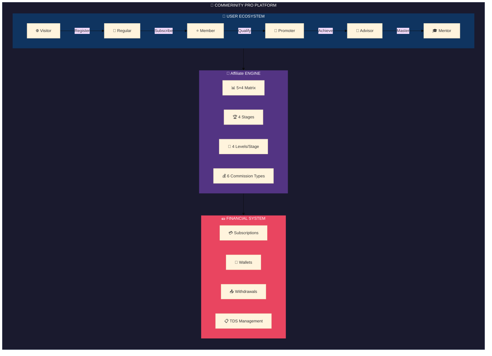

# Commerinity Pro - Visual Blueprint

<div align="center">

```
╔══════════════════════════════════════════════════════════════════╗
║                                                                  ║
║     ██████╗ ██████╗ ███╗   ███╗███╗   ███╗███████╗██████╗       ║
║    ██╔════╝██╔═══██╗████╗ ████║████╗ ████║██╔════╝██╔══██╗      ║
║    ██║     ██║   ██║██╔████╔██║██╔████╔██║█████╗  ██████╔╝      ║
║    ██║     ██║   ██║██║╚██╔╝██║██║╚██╔╝██║██╔══╝  ██╔══██╗      ║
║    ╚██████╗╚██████╔╝██║ ╚═╝ ██║██║ ╚═╝ ██║███████╗██║  ██║      ║
║     ╚═════╝ ╚═════╝ ╚═╝     ╚═╝╚═╝     ╚═╝╚══════╝╚═╝  ╚═╝      ║
║                                                                  ║
║              MULTI-LEVEL MARKETING PLATFORM                      ║
║                   Visual Blueprint v1.0                          ║
║                                                                  ║
╚══════════════════════════════════════════════════════════════════╝
```

**Enterprise Affiliate Platform with 5×4 Matrix Structure**

[](#progress-tracker)
[](#progress-tracker)
[](#test-coverage)
[](#)

</div>

---

## Navigation Hub

<table>
<tr>
<td width="33%" align="center">

### 👥 [User Ecosystem](./users/INDEX.md)
*All user types & their journeys*

```
├── Regular User
├── Member
├── Promoter
├── Advisor
├── Mentor
└── Admin
```

</td>
<td width="33%" align="center">

### 🌳 [Affiliate Blueprint](./affiliate/INDEX.md)
*Matrix, levels & commissions*

```
├── 5×4 Matrix Structure
├── Stage Progression
├── Commission Types
└── Team Building
```

</td>
<td width="33%" align="center">

### 💼 [Business Flows](./flows/INDEX.md)
*Core operations & processes*

```
├── Registration
├── Subscription
├── Payments
└── Withdrawals
```

</td>
</tr>
<tr>
<td align="center">

### 🛡️ [Admin Center](./admin/INDEX.md)
*Management & controls*

```
├── Dashboard
├── User Management
├── Financial Controls
└── System Settings
```

</td>
<td align="center">

### 📊 [Progress Tracker](./PROGRESS.md)
*Development status*

```
├── Module Status
├── Test Coverage
├── Milestones
└── Roadmap
```

</td>
<td align="center">

### ❓ [FAQ & Guide](./FAQ.md)
*Help & documentation*

```
├── Getting Started
├── Common Questions
├── Troubleshooting
└── Glossary
```

</td>
</tr>
</table>

---

## Platform Overview



---

## Quick Stats

| Metric | Value | Indicator |
|--------|-------|-----------|
| **Max Team Size** | 780 members | `5 + 25 + 125 + 625` |
| **Commission Depth** | 4 Levels | Direct to L4 |
| **Stages** | 4 | Basic → Premium → Elite → Royal |
| **Levels per Stage** | 4 | Bronze → Silver → Gold → Diamond |
| **User Types** | 6 | Visitor to Mentor |
| **Commission Types** | 6+ | Sponsor, Level, Matching, Pool... |

---

## Color Legend

| Color | Meaning | Usage |
|-------|---------|-------|
| 🟢 `#2ecc71` | **Success / Active / Complete** | Completed features, active users |
| 🔵 `#3498db` | **Primary / Navigation** | Main actions, links |
| 🟡 `#f1c40f` | **Warning / Pending** | In-progress, needs attention |
| 🟠 `#f39c12` | **Highlight / Important** | Key information |
| 🔴 `#e74c3c` | **Error / Critical** | Blockers, failures |
| 🟣 `#9b59b6` | **Premium / Special** | VIP features, bonuses |
| ⚪ `#95a5a6` | **Inactive / Disabled** | Unavailable features |

---

## Document Map

```
docs/flowcharts/
│
├── 📄 README.md .................. You are here (Navigation Hub)
│
├── 👥 users/ ..................... User Type Documentation
│   ├── INDEX.md .................. User ecosystem overview
│   ├── regular.md ................ Regular user journey
│   ├── member.md ................. Member features & flow
│   ├── promoter.md ............... Promoter capabilities
│   ├── advisor.md ................ Advisor/Agent system
│   ├── mentor.md ................. Mentor privileges
│   └── connections.md ............ How users interconnect
│
├── 🌳 affiliate/ ....................... Affiliate System Documentation
│   ├── INDEX.md .................. Affiliate overview
│   ├── matrix.md ................. 5×4 Matrix explained
│   ├── stages.md ................. Stage progression
│   ├── levels.md ................. Level requirements
│   ├── commissions.md ............ Commission calculations
│   └── genealogy.md .............. Team tree structure
│
├── 💼 flows/ ..................... Business Process Flows
│   ├── INDEX.md .................. All flows overview
│   ├── registration.md ........... Sign-up process
│   ├── subscription.md ........... Plan purchase flow
│   ├── payment.md ................ Payment processing
│   ├── withdrawal.md ............. Payout process
│   └── kyc.md .................... Verification flow
│
├── 🛡️ admin/ ..................... Admin Documentation
│   ├── INDEX.md .................. Admin overview
│   ├── dashboard.md .............. Dashboard widgets
│   ├── management.md ............. User/financial management
│   └── settings.md ............... System configuration
│
├── 📊 PROGRESS.md ................ Development progress tracker
└── ❓ FAQ.md ..................... Frequently asked questions
```

---

## Getting Started

1. **New to the platform?** → Start with [User Ecosystem](./users/INDEX.md)
2. **Understanding Affiliate?** → Read [Affiliate Blueprint](./affiliate/INDEX.md)
3. **Technical integration?** → Check [Business Flows](./flows/INDEX.md)
4. **Admin operations?** → Visit [Admin Center](./admin/INDEX.md)
5. **Development status?** → See [Progress Tracker](./PROGRESS.md)

---

<div align="center">

**[👥 Users](./users/INDEX.md)** • **[🌳 Affiliate](./affiliate/INDEX.md)** • **[💼 Flows](./flows/INDEX.md)** • **[🛡️ Admin](./admin/INDEX.md)** • **[📊 Progress](./PROGRESS.md)** • **[❓ FAQ](./FAQ.md)**

---

*This documentation evolves with the project. Last sync: December 2024*

</div>
