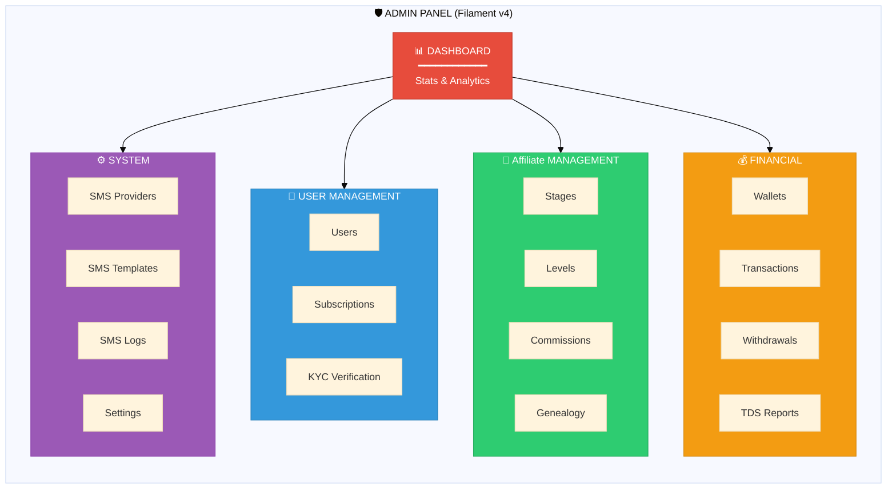
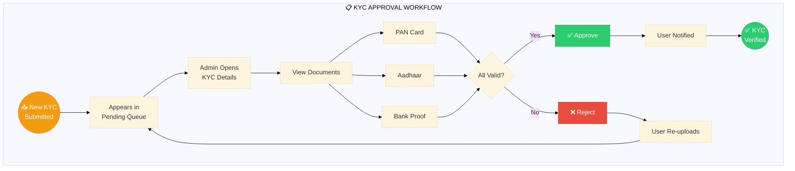
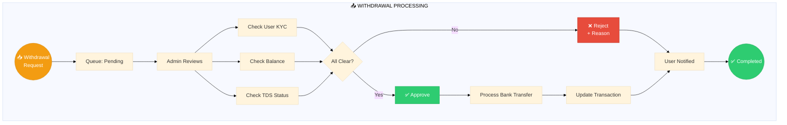
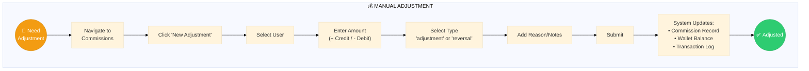
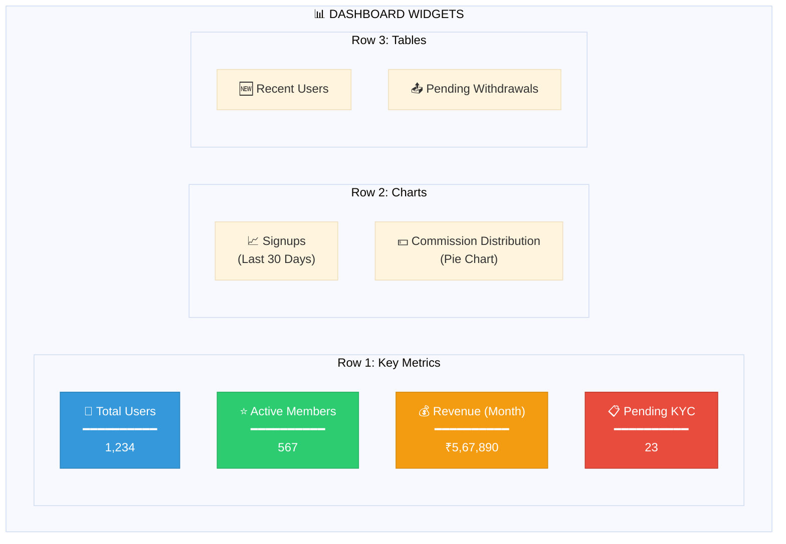

# Admin Center

<div align="center">

```
┌─────────────────────────────────────────────────────────────┐
│                    🛡️ ADMIN CENTER                          │
│        Dashboard • Management • Controls • Settings         │
└─────────────────────────────────────────────────────────────┘
```

**[← Flows](../flows/INDEX.md)** • **[Hub](../README.md)** • **[Progress →](../PROGRESS.md)**

</div>

---

## Admin Dashboard Overview



---

## Admin Navigation Map

```
🛡️ ADMIN PANEL (/admin)
│
├── 📊 Dashboard ─────────────────────── /admin
│   ├── Total Users Widget
│   ├── Active Subscriptions Widget
│   ├── Revenue This Month Widget
│   ├── Pending KYC Widget
│   └── Recent Activities
│
├── 👥 User Management ───────────────── /admin/users
│   ├── 📋 All Users ──────────────────── /admin/users
│   │   ├── View User Details
│   │   ├── Edit User
│   │   ├── Ban/Unban User
│   │   └── Impersonate User
│   │
│   ├── 💳 Subscriptions ──────────────── /admin/user-subscriptions
│   │   ├── View All Subscriptions
│   │   ├── Activate Manually
│   │   ├── Extend Expiry
│   │   └── Cancel Subscription
│   │
│   └── 📋 KYC Verification ───────────── /admin/kycs
│       ├── Pending Queue
│       ├── Approve/Reject
│       └── View Documents
│
├── 🌳 Affiliate Management ────────────────── /admin/affiliate
│   ├── 🏆 Stages ─────────────────────── /admin/stages
│   │   ├── Create Stage
│   │   ├── Set Pricing
│   │   ├── Configure Commission Rates
│   │   └── Manage Benefits
│   │
│   ├── 💎 Levels ─────────────────────── /admin/levels
│   │   ├── Create Level
│   │   ├── Set Requirements
│   │   └── Configure Bonuses
│   │
│   ├── 💰 Commissions ────────────────── /admin/affiliate-commissions
│   │   ├── View All Commissions
│   │   ├── Filter by Type
│   │   ├── Export Reports
│   │   └── Manual Adjustments
│   │
│   └── 🌲 Genealogy ──────────────────── /admin/affiliate-genealogies
│       ├── Tree Visualization
│       ├── User Statistics
│       └── Team Analysis
│
├── 💰 Financial ─────────────────────── /admin/finance
│   ├── 👛 Wallets ────────────────────── /admin/wallets
│   │   ├── View Balances
│   │   ├── Manual Credit/Debit
│   │   └── Lock/Unlock
│   │
│   ├── 📝 Transactions ───────────────── /admin/transactions
│   │   ├── All Transactions
│   │   ├── Filter by Type
│   │   └── Export Reports
│   │
│   └── 📤 Withdrawals ────────────────── /admin/withdrawals
│       ├── Pending Queue
│       ├── Approve/Reject
│       └── Process Payout
│
└── ⚙️ System ────────────────────────── /admin/system
    ├── 📱 SMS Providers ──────────────── /admin/sms-providers
    │   ├── Add Provider
    │   ├── Set Default
    │   └── Test Connection
    │
    ├── 📝 SMS Templates ──────────────── /admin/sms-templates
    │   ├── OTP Template
    │   ├── Welcome Template
    │   └── Notification Templates
    │
    └── 📋 SMS Logs ───────────────────── /admin/sms-logs
        ├── Delivery Status
        └── Error Logs
```

---

## Admin Workflows

### 1. KYC Approval Workflow



### 2. Withdrawal Processing Workflow



### 3. Manual Commission Adjustment



---

## Filament Resources Summary

| Resource | Path | Features | Status |
|----------|------|----------|--------|
| **UserResource** | `/admin/users` | CRUD, Filter, Search | ✅ Ready |
| **UserSubscriptionResource** | `/admin/user-subscriptions` | CRUD, Status Filter | ✅ Ready |
| **StageResource** | `/admin/stages` | CRUD, Pricing Config | ✅ Ready |
| **LevelResource** | `/admin/levels` | CRUD, Requirements | ✅ Ready |
| **MlmCommissionResource** | `/admin/affiliate-commissions` | View, Filter, Export | ✅ Ready |
| **MlmGenealogyResource** | `/admin/affiliate-genealogies` | View, Stats | ✅ Ready |
| **WalletResource** | `/admin/wallets` | View, Manual Ops | ✅ Ready |
| **TransactionResource** | `/admin/transactions` | View, Filter | ✅ Ready |
| **KycResource** | `/admin/kycs` | Approve/Reject | ✅ Ready |
| **SmsProviderResource** | `/admin/sms-providers` | CRUD, Test | ✅ Ready |
| **SmsTemplateResource** | `/admin/sms-templates` | CRUD | ✅ Ready |
| **SmsLogResource** | `/admin/sms-logs` | View Only | ✅ Ready |

---

## Admin Permission Matrix

```
ROLE PERMISSIONS MATRIX
━━━━━━━━━━━━━━━━━━━━━━━━━━━━━━━━━━━━━━━━━━━━━━━━━━━━━━━━━━━━━━━━━━━

                        │ Super │ Admin │ Finance │ Support │
                        │ Admin │       │ Manager │         │
────────────────────────┼───────┼───────┼─────────┼─────────┤
VIEW DASHBOARD          │   ✅   │   ✅   │    ✅    │    ✅    │
────────────────────────┼───────┼───────┼─────────┼─────────┤
MANAGE USERS            │   ✅   │   ✅   │    ❌    │    👁️    │
MANAGE SUBSCRIPTIONS    │   ✅   │   ✅   │    ❌    │    👁️    │
VERIFY KYC              │   ✅   │   ✅   │    ❌    │    ✅    │
────────────────────────┼───────┼───────┼─────────┼─────────┤
MANAGE STAGES/LEVELS    │   ✅   │   ✅   │    ❌    │    ❌    │
VIEW COMMISSIONS        │   ✅   │   ✅   │    ✅    │    👁️    │
ADJUST COMMISSIONS      │   ✅   │   ✅   │    ❌    │    ❌    │
────────────────────────┼───────┼───────┼─────────┼─────────┤
VIEW WALLETS            │   ✅   │   ✅   │    ✅    │    ❌    │
MANUAL WALLET OPS       │   ✅   │   ❌   │    ✅    │    ❌    │
PROCESS WITHDRAWALS     │   ✅   │   ❌   │    ✅    │    ❌    │
────────────────────────┼───────┼───────┼─────────┼─────────┤
MANAGE SMS              │   ✅   │   ✅   │    ❌    │    ❌    │
SYSTEM SETTINGS         │   ✅   │   ❌   │    ❌    │    ❌    │
────────────────────────┴───────┴───────┴─────────┴─────────┘

Legend: ✅ Full Access | 👁️ View Only | ❌ No Access
```

---

## Dashboard Widgets



---

## Quick Actions

| Action | Navigation | Keyboard |
|--------|------------|----------|
| **New User** | Users → Create | `Ctrl+Shift+U` |
| **Approve KYC** | KYC → Pending → View → Approve | - |
| **Process Withdrawal** | Withdrawals → Pending → Approve | - |
| **View Tree** | Genealogy → Select User → View Tree | - |
| **Export Report** | Any Resource → Actions → Export | - |

---

## Navigation

| Previous | Up | Next |
|----------|----|----|
| [💼 Flows](../flows/INDEX.md) | [🏠 Hub](../README.md) | [📊 Progress](../PROGRESS.md) |

---

<div align="center">

**[Dashboard](./dashboard.md)** • **[User Mgmt](./management.md)** • **[Financial](./financial.md)** • **[Settings](./settings.md)**

</div>
