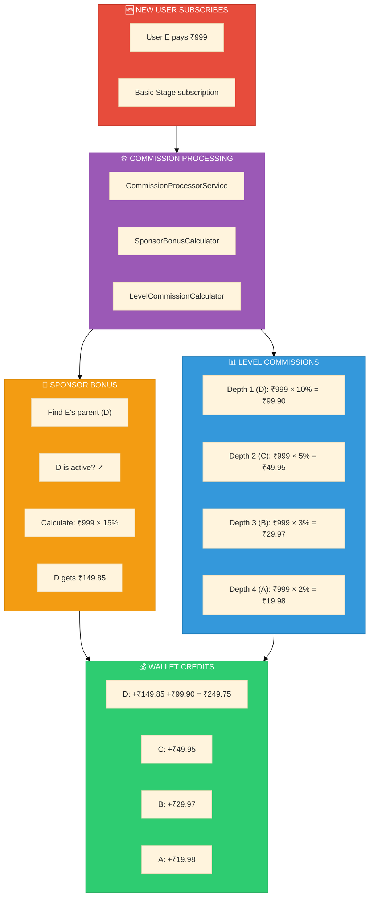
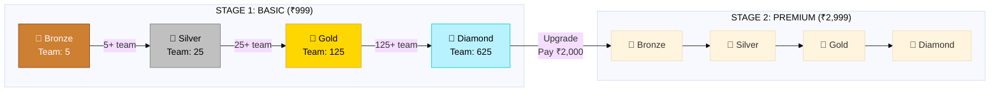

# Current System - Complete Documentation

<div align="center">

```
┌─────────────────────────────────────────────────────────────────────────┐
│                                                                         │
│                    📋 CURRENT SYSTEM STATE                              │
│                                                                         │
│                 As Implemented in Codebase                              │
│                    December 2024                                        │
│                                                                         │
└─────────────────────────────────────────────────────────────────────────┘
```

**[← Affiliate Index](./INDEX.md)** • **[Compare →](./PROPOSED-SYSTEM.md)**

</div>

---

## 1. System Configuration

```
CURRENT Affiliate CONFIGURATION
━━━━━━━━━━━━━━━━━━━━━━━━━━━━━━━━━━━━━━━━━━━━━━━━━━━━━━━━━━━━━━━━━━━━━━━━━━━

Matrix Type:          5-Width × 4-Depth
Levels per Stage:     4 (Bronze, Silver, Gold, Diamond)
Max Team per Stage:   780 (5 + 25 + 125 + 625)
Stages:               4 (Basic, Premium, Elite, Royal)
Total Ranks:          16 (4 stages × 4 levels)
```

---

## 2. Stage Configuration (Pricing)

```
STAGE PRICING TABLE
━━━━━━━━━━━━━━━━━━━━━━━━━━━━━━━━━━━━━━━━━━━━━━━━━━━━━━━━━━━━━━━━━━━━━━━━━━━

┌──────────┬─────────────┬────────────┬─────────────┬─────────┐
│ Stage    │ Base Price  │ GST (18%)  │ Final Price │ PV      │
├──────────┼─────────────┼────────────┼─────────────┼─────────┤
│ Basic    │ ₹999        │ ₹179.82    │ ₹1,178.82   │ 100     │
│ Premium  │ ₹2,999      │ ₹539.82    │ ₹3,538.82   │ 300     │
│ Elite    │ ₹5,999      │ ₹1,079.82  │ ₹7,078.82   │ 600     │
│ Royal    │ ₹9,999      │ ₹1,799.82  │ ₹11,798.82  │ 1000    │
└──────────┴─────────────┴────────────┴─────────────┴─────────┘

Source: database/factories/Membership/StageFactory.php (lines 21-25)
```

---

## 3. Level Configuration

```
LEVEL STRUCTURE (Per Stage)
━━━━━━━━━━━━━━━━━━━━━━━━━━━━━━━━━━━━━━━━━━━━━━━━━━━━━━━━━━━━━━━━━━━━━━━━━━━

┌─────────┬──────────┬───────────────┬──────────────────┬─────────────────┐
│ Level # │ Name     │ Team Limit    │ Min Direct       │ Min Active      │
│         │          │ (5^n)         │ Referrals        │ Directs         │
├─────────┼──────────┼───────────────┼──────────────────┼─────────────────┤
│ 1       │ Bronze   │ 5             │ 1                │ 1               │
│ 2       │ Silver   │ 25            │ 2                │ 1               │
│ 3       │ Gold     │ 125           │ 3                │ 2               │
│ 4       │ Diamond  │ 625           │ 4                │ 3               │
└─────────┴──────────┴───────────────┴──────────────────┴─────────────────┘

Formula: team_member_limit = 5^level_number
Source: app/Models/Membership/Level.php (lines 93-95)
```

---

## 4. Commission Configuration

### 4.1 Commission Rates (Stored in Stage)

```
COMMISSION RATES JSON
━━━━━━━━━━━━━━━━━━━━━━━━━━━━━━━━━━━━━━━━━━━━━━━━━━━━━━━━━━━━━━━━━━━━━━━━━━━

'commission_rates' => [
    'level_1' => 10,    // 10% for depth 1 (direct sponsor's upline)
    'level_2' => 5,     // 5% for depth 2
    'level_3' => 3,     // 3% for depth 3
    'level_4' => 2,     // 2% for depth 4
],

Source: database/factories/Membership/StageFactory.php (lines 53-58)
```

### 4.2 Sponsor Bonus Configuration

```
SPONSOR BONUS JSON
━━━━━━━━━━━━━━━━━━━━━━━━━━━━━━━━━━━━━━━━━━━━━━━━━━━━━━━━━━━━━━━━━━━━━━━━━━━

'sponsor_bonus' => [
    'type' => 'percent',
    'value' => 15,      // 15% of subscription amount
],

Source: database/factories/Membership/StageFactory.php (lines 59-62)
```

### 4.3 Level Achievement Bonus

```
LEVEL ACHIEVEMENT BONUS JSON
━━━━━━━━━━━━━━━━━━━━━━━━━━━━━━━━━━━━━━━━━━━━━━━━━━━━━━━━━━━━━━━━━━━━━━━━━━━

'level_achievement_bonus' => [
    1 => 50000,         // ₹500 for Bronze (in paisa)
    2 => 100000,        // ₹1,000 for Silver
    3 => 200000,        // ₹2,000 for Gold
    4 => 500000,        // ₹5,000 for Diamond
],

Source: database/factories/Membership/StageFactory.php (lines 66-71)
```

---

## 5. Commission Calculation Logic

### 5.1 Sponsor Bonus Calculator

```
SPONSOR BONUS CALCULATION
━━━━━━━━━━━━━━━━━━━━━━━━━━━━━━━━━━━━━━━━━━━━━━━━━━━━━━━━━━━━━━━━━━━━━━━━━━━

FILE: app/Services/Mlm/Calculators/SponsorBonusCalculator.php

TRIGGER: subscription, joining

FLOW:
1. Get triggering user
2. Check if user has parent_id (sponsor)
3. Check if sponsor has active subscription
4. Calculate: baseAmount × sponsor_bonus.value%

FORMULA:
┌─────────────────────────────────────────────────────────────────────────┐
│                                                                         │
│   sponsor_bonus = subscription_amount × (sponsor_bonus.value / 100)     │
│                                                                         │
│   Example: ₹999 × 15% = ₹149.85                                        │
│                                                                         │
└─────────────────────────────────────────────────────────────────────────┘

CODE (lines 60-63):
    $bonusAmount = $stage
        ? $stage->getSponsorBonusAmount($baseAmount)
        : $this->calculatePercent($baseAmount,
            $this->getRateFromConfig('affiliate.default_sponsor_bonus_percent', 10));
```

### 5.2 Level Commission Calculator

```
LEVEL COMMISSION CALCULATION
━━━━━━━━━━━━━━━━━━━━━━━━━━━━━━━━━━━━━━━━━━━━━━━━━━━━━━━━━━━━━━━━━━━━━━━━━━━

FILE: app/Services/Mlm/Calculators/LevelCommissionCalculator.php

TRIGGER: subscription, joining, purchase

FLOW:
1. Get triggering user
2. Get stage from context
3. Traverse upline (max 4 levels)
4. For each ancestor:
   a. Get depth (1-4)
   b. Get rate from stage.commission_rates[depth]
   c. Calculate commission
   d. Credit to ancestor's wallet

FORMULA:
┌─────────────────────────────────────────────────────────────────────────┐
│                                                                         │
│   FOR each ancestor at depth N (1 to 4):                                │
│       commission[N] = subscription_amount × (commission_rates[N] / 100) │
│                                                                         │
│   Example (₹999 subscription):                                          │
│       Depth 1: ₹999 × 10% = ₹99.90                                     │
│       Depth 2: ₹999 × 5%  = ₹49.95                                     │
│       Depth 3: ₹999 × 3%  = ₹29.97                                     │
│       Depth 4: ₹999 × 2%  = ₹19.98                                     │
│                                                                         │
└─────────────────────────────────────────────────────────────────────────┘

CODE (lines 68-102):
    foreach ($ancestors as $depth => $ancestor) {
        $level = $depth + 1;
        $ratePercent = $stage->getCommissionRate($level);
        $commissionAmount = $this->calculatePercent($baseAmount, $ratePercent);
        // ... credit to wallet
    }
```

---

## 6. Visual Flow Diagrams

### 6.1 Commission Flow - Single New User



### 6.2 Team Tree Visualization

```
TEAM TREE - COMMISSION DISTRIBUTION
━━━━━━━━━━━━━━━━━━━━━━━━━━━━━━━━━━━━━━━━━━━━━━━━━━━━━━━━━━━━━━━━━━━━━━━━━━━

When User E subscribes for ₹999:

┌─────────────────────────────────────────────────────────────────────────┐
│                                                                         │
│                         User A                                          │
│                    ┌─────────────┐                                      │
│                    │ 💎 Diamond  │                                      │
│                    │ Depth 4     │                                      │
│                    │ ─────────── │                                      │
│                    │ Gets: ₹19.98│                                      │
│                    │ (2%)        │                                      │
│                    └──────┬──────┘                                      │
│                           │                                             │
│                         User B                                          │
│                    ┌─────────────┐                                      │
│                    │ 🥇 Gold     │                                      │
│                    │ Depth 3     │                                      │
│                    │ ─────────── │                                      │
│                    │ Gets: ₹29.97│                                      │
│                    │ (3%)        │                                      │
│                    └──────┬──────┘                                      │
│                           │                                             │
│                         User C                                          │
│                    ┌─────────────┐                                      │
│                    │ 🥈 Silver   │                                      │
│                    │ Depth 2     │                                      │
│                    │ ─────────── │                                      │
│                    │ Gets: ₹49.95│                                      │
│                    │ (5%)        │                                      │
│                    └──────┬──────┘                                      │
│                           │                                             │
│                         User D                                          │
│                    ┌─────────────┐                                      │
│                    │ 🥉 Bronze   │                                      │
│                    │ Depth 1     │                                      │
│                    │ SPONSOR     │                                      │
│                    │ ─────────── │                                      │
│                    │ Sponsor:    │                                      │
│                    │   ₹149.85   │                                      │
│                    │ Level:      │                                      │
│                    │   ₹99.90    │                                      │
│                    │ ─────────── │                                      │
│                    │ TOTAL:      │                                      │
│                    │   ₹249.75   │                                      │
│                    └──────┬──────┘                                      │
│                           │                                             │
│                    ┌──────▼──────┐                                      │
│                    │ 🆕 User E   │                                      │
│                    │ NEW MEMBER  │                                      │
│                    │ ═══════════ │                                      │
│                    │ PAYS: ₹999  │                                      │
│                    │ Joins:      │                                      │
│                    │ Bronze L1   │                                      │
│                    └─────────────┘                                      │
│                                                                         │
└─────────────────────────────────────────────────────────────────────────┘
```

### 6.3 Level Progression Flow



---

## 7. Commission Summary Table

```
CURRENT SYSTEM - COMMISSION SUMMARY
━━━━━━━━━━━━━━━━━━━━━━━━━━━━━━━━━━━━━━━━━━━━━━━━━━━━━━━━━━━━━━━━━━━━━━━━━━━

┌────────────────────────┬────────────┬──────────────────────────────────┐
│ Commission Type        │ Rate       │ Calculation (₹999 base)          │
├────────────────────────┼────────────┼──────────────────────────────────┤
│ Sponsor Bonus          │ 15%        │ ₹999 × 0.15 = ₹149.85           │
│ Level 1 (Depth 1)      │ 10%        │ ₹999 × 0.10 = ₹99.90            │
│ Level 2 (Depth 2)      │ 5%         │ ₹999 × 0.05 = ₹49.95            │
│ Level 3 (Depth 3)      │ 3%         │ ₹999 × 0.03 = ₹29.97            │
│ Level 4 (Depth 4)      │ 2%         │ ₹999 × 0.02 = ₹19.98            │
├────────────────────────┼────────────┼──────────────────────────────────┤
│ TOTAL PAYOUT           │ 35%        │ ₹349.65                          │
│ COMPANY KEEPS          │ 65%        │ ₹649.35                          │
├────────────────────────┼────────────┼──────────────────────────────────┤
│ Direct Sponsor Gets    │ 25%        │ ₹249.75 (Sponsor + L1)           │
└────────────────────────┴────────────┴──────────────────────────────────┘
```

---

## 8. P&L Analysis (Current System)

```
PROFIT & LOSS - CURRENT SYSTEM
━━━━━━━━━━━━━━━━━━━━━━━━━━━━━━━━━━━━━━━━━━━━━━━━━━━━━━━━━━━━━━━━━━━━━━━━━━━

PER SUBSCRIPTION (₹999 - Full 4-level upline):

REVENUE:
├── Subscription:                              ₹999.00

COMMISSION EXPENSES:
├── Sponsor Bonus (15%):                       -₹149.85
├── Level 1 Commission (10%):                  -₹99.90
├── Level 2 Commission (5%):                   -₹49.95
├── Level 3 Commission (3%):                   -₹29.97
├── Level 4 Commission (2%):                   -₹19.98
├── ─────────────────────────────────────────────────────
├── TOTAL COMMISSION:                          -₹349.65 (35%)

GROSS MARGIN:
├── Revenue - Commission:                      ₹649.35 (65%)

OPERATING COSTS (Estimated):
├── Payment Gateway (2%):                      -₹19.98
├── Server/Infrastructure (2%):                -₹19.98
├── Support/Operations (3%):                   -₹29.97
├── Marketing (5%):                            -₹49.95
├── ─────────────────────────────────────────────────────
├── TOTAL OPERATING:                           -₹119.88 (12%)

NET PROFIT:
├── Gross Margin - Operating:                  ₹529.47 (53%)

┌─────────────────────────────────────────────────────────────────────────┐
│                                                                         │
│   NET PROFIT MARGIN: 53% (₹529.47 per ₹999 subscription)               │
│                                                                         │
│   ✅ SUSTAINABLE but lower margin due to high commission payout         │
│                                                                         │
└─────────────────────────────────────────────────────────────────────────┘
```

---

## 9. Source Code References

```
FILE REFERENCES
━━━━━━━━━━━━━━━━━━━━━━━━━━━━━━━━━━━━━━━━━━━━━━━━━━━━━━━━━━━━━━━━━━━━━━━━━━━

MODELS:
├── app/Models/Membership/Stage.php
│   ├── commission_rates (JSON column)
│   ├── sponsor_bonus (JSON column)
│   ├── level_achievement_bonus (JSON column)
│   ├── getCommissionRate(int $depth): float
│   └── getSponsorBonusAmount(int $price): int
│
├── app/Models/Membership/Level.php
│   ├── team_member_limit = 5^level_number
│   ├── min_direct_referrals
│   ├── min_active_directs
│   └── checkQualification(array $stats): bool
│
└── app/Models/Membership/UserSubscription.php
    ├── implements CommissionTrigger
    ├── getCommissionableAmount(): int
    └── activate(): void (triggers commission)

SERVICES:
├── app/Services/Mlm/CommissionProcessorService.php
│   └── process(CommissionTrigger $trigger): Collection
│
├── app/Services/Mlm/Calculators/SponsorBonusCalculator.php
│   └── doCalculate(): Collection
│
└── app/Services/Mlm/Calculators/LevelCommissionCalculator.php
    └── doCalculate(): Collection

FACTORIES:
├── database/factories/Membership/StageFactory.php
│   └── Default commission_rates, sponsor_bonus values
│
└── database/factories/Membership/LevelFactory.php
    └── Default level requirements

TESTS:
└── tests/Feature/Mlm/MlmJourneyTest.php
    └── 22 tests, 92 assertions - ALL PASSING
```

---

## 10. Database Schema

```
DATABASE TABLES
━━━━━━━━━━━━━━━━━━━━━━━━━━━━━━━━━━━━━━━━━━━━━━━━━━━━━━━━━━━━━━━━━━━━━━━━━━━

TABLE: stages
├── id
├── name (Basic, Premium, Elite, Royal)
├── base_price (paisa)
├── price (with tax, paisa)
├── commission_rates (JSON)
├── sponsor_bonus (JSON)
├── level_achievement_bonus (JSON)
├── matrix_width (5)
├── matrix_depth (4)
└── max_team_members (780)

TABLE: levels
├── id
├── stage_id (FK)
├── name (Bronze, Silver, Gold, Diamond)
├── level_number (1-4)
├── team_member_limit (5, 25, 125, 625)
├── min_direct_referrals
├── min_active_directs
├── joining_bonus
└── depth_commissions (JSON)

TABLE: affiliate_commissions
├── id
├── user_id (recipient)
├── triggering_user_id
├── type (sponsor_bonus, level_commission, etc.)
├── gross_amount
├── net_amount
├── rate_percent
├── level (depth)
└── status
```

---

## Navigation

| Previous | Up | Next |
|----------|----|----|
| [Affiliate Index](./INDEX.md) | [Hub](../README.md) | [Proposed System](./PROPOSED-SYSTEM.md) |

---

<div align="center">

**Status: IMPLEMENTED & TESTED**
<br>
*22 Tests Passing • 92 Assertions*
<br>
*December 2024*

</div>
