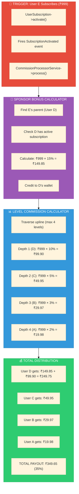
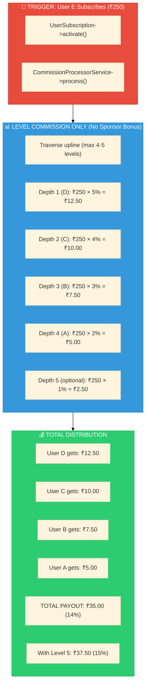

# Affiliate Commission System - Complete Comparison

<div align="center">

```
┌─────────────────────────────────────────────────────────────────────────┐
│                                                                         │
│            📊 COMMISSION SYSTEM COMPARISON                              │
│                                                                         │
│         CURRENT IMPLEMENTATION vs PROPOSED FORMULA                      │
│                                                                         │
│         Full Simulation • P&L Analysis • Sustainability                 │
│                                                                         │
└─────────────────────────────────────────────────────────────────────────┘
```

**[← Affiliate Index](./INDEX.md)** • **[Hub](../README.md)**

</div>

---

# PART 1: CURRENT SYSTEM (What We Built)

---

## 1.1 Current Architecture

```
CURRENT SYSTEM ARCHITECTURE
━━━━━━━━━━━━━━━━━━━━━━━━━━━━━━━━━━━━━━━━━━━━━━━━━━━━━━━━━━━━━━━━━━━━━━━━━━━

Source Files:
├── app/Services/Mlm/Calculators/SponsorBonusCalculator.php
├── app/Services/Mlm/Calculators/LevelCommissionCalculator.php
├── app/Models/Membership/Stage.php
├── app/Models/Membership/Level.php
└── database/factories/Membership/StageFactory.php

Matrix Configuration:
├── Width: 5 (direct referrals per user)
├── Depth: 4 (commission levels)
└── Max Team: 5 + 25 + 125 + 625 = 780 members
```

## 1.2 Current Level Structure

```
CURRENT LEVEL STRUCTURE (4 Levels per Stage)
━━━━━━━━━━━━━━━━━━━━━━━━━━━━━━━━━━━━━━━━━━━━━━━━━━━━━━━━━━━━━━━━━━━━━━━━━━━

┌─────────┬──────────┬───────────────────┬─────────────────────────────────┐
│ Level   │ Name     │ Team Limit        │ Requirements                    │
│         │          │ (5^level_number)  │ (min_direct_referrals)          │
├─────────┼──────────┼───────────────────┼─────────────────────────────────┤
│ Level 1 │ Bronze   │ 5^1 = 5           │ 1 direct referral               │
│ Level 2 │ Silver   │ 5^2 = 25          │ 2 direct referrals              │
│ Level 3 │ Gold     │ 5^3 = 125         │ 3 direct referrals              │
│ Level 4 │ Diamond  │ 5^4 = 625         │ 4 direct referrals              │
└─────────┴──────────┴───────────────────┴─────────────────────────────────┘

Code Reference (Level.php:93-95):
    if (! $level->team_member_limit && $level->level_number) {
        $level->team_member_limit = (int) pow(5, $level->level_number);
    }
```

## 1.3 Current Stage Configuration

```
CURRENT STAGE PRICING (from StageFactory.php)
━━━━━━━━━━━━━━━━━━━━━━━━━━━━━━━━━━━━━━━━━━━━━━━━━━━━━━━━━━━━━━━━━━━━━━━━━━━

┌─────────┬────────────┬──────────┬───────────┬────────────────────────────┐
│ Stage   │ Base Price │ GST 18%  │ Final     │ PV                         │
│         │ (paisa)    │ (paisa)  │ (paisa)   │                            │
├─────────┼────────────┼──────────┼───────────┼────────────────────────────┤
│ Basic   │ 99,900     │ 17,982   │ 1,17,882  │ 100                        │
│         │ (₹999)     │ (₹179.82)│ (₹1,178.82)                            │
├─────────┼────────────┼──────────┼───────────┼────────────────────────────┤
│ Premium │ 2,99,900   │ 53,982   │ 3,53,882  │ 300                        │
│         │ (₹2,999)   │ (₹539.82)│ (₹3,538.82)                            │
├─────────┼────────────┼──────────┼───────────┼────────────────────────────┤
│ Elite   │ 5,99,900   │ 1,07,982 │ 7,07,882  │ 600                        │
│         │ (₹5,999)   │          │ (₹7,078.82)                            │
├─────────┼────────────┼──────────┼───────────┼────────────────────────────┤
│ Royal   │ 9,99,900   │ 1,79,982 │ 11,79,882 │ 1000                       │
│         │ (₹9,999)   │          │ (₹11,798.82)                           │
└─────────┴────────────┴──────────┴───────────┴────────────────────────────┘
```

## 1.4 Current Commission Configuration

```
CURRENT COMMISSION RATES (from StageFactory.php:53-58)
━━━━━━━━━━━━━━━━━━━━━━━━━━━━━━━━━━━━━━━━━━━━━━━━━━━━━━━━━━━━━━━━━━━━━━━━━━━

'commission_rates' => [
    'level_1' => 10,  // 10% for depth 1
    'level_2' => 5,   // 5% for depth 2
    'level_3' => 3,   // 3% for depth 3
    'level_4' => 2,   // 2% for depth 4
],

'sponsor_bonus' => [
    'type' => 'percent',
    'value' => 15,    // 15% sponsor bonus
],

'level_achievement_bonus' => [
    1 => 50000,       // ₹500 for Bronze
    2 => 100000,      // ₹1,000 for Silver
    3 => 200000,      // ₹2,000 for Gold
    4 => 500000,      // ₹5,000 for Diamond
],
```

## 1.5 Current Commission Calculation Flow



## 1.6 Current System - Visual Tree Example

```
CURRENT SYSTEM: COMMISSION FLOW VISUALIZATION
━━━━━━━━━━━━━━━━━━━━━━━━━━━━━━━━━━━━━━━━━━━━━━━━━━━━━━━━━━━━━━━━━━━━━━━━━━━

When User E subscribes for ₹999 (Basic Stage):

                    ┌─────────────────────────────────┐
                    │ User A (Diamond Level)          │
                    │ Depth 4 from E                  │
                    │ ─────────────────────────────── │
                    │ Level Commission: ₹999 × 2%     │
                    │ = ₹19.98                        │
                    └────────────────┬────────────────┘
                                     │
                    ┌────────────────▼────────────────┐
                    │ User B (Gold Level)             │
                    │ Depth 3 from E                  │
                    │ ─────────────────────────────── │
                    │ Level Commission: ₹999 × 3%     │
                    │ = ₹29.97                        │
                    └────────────────┬────────────────┘
                                     │
                    ┌────────────────▼────────────────┐
                    │ User C (Silver Level)           │
                    │ Depth 2 from E                  │
                    │ ─────────────────────────────── │
                    │ Level Commission: ₹999 × 5%     │
                    │ = ₹49.95                        │
                    └────────────────┬────────────────┘
                                     │
                    ┌────────────────▼────────────────┐
                    │ User D (Bronze Level)           │
                    │ Depth 1 from E (Direct Sponsor) │
                    │ ─────────────────────────────── │
                    │ Sponsor Bonus: ₹999 × 15%       │
                    │ = ₹149.85                       │
                    │ Level Commission: ₹999 × 10%    │
                    │ = ₹99.90                        │
                    │ ─────────────────────────────── │
                    │ TOTAL: ₹249.75                  │
                    └────────────────┬────────────────┘
                                     │
                    ┌────────────────▼────────────────┐
                    │ User E (NEW SUBSCRIBER)         │
                    │ ═══════════════════════════════ │
                    │ PAYS: ₹999                      │
                    │ Joins at: Bronze Level          │
                    └─────────────────────────────────┘


CURRENT SYSTEM SUMMARY:
━━━━━━━━━━━━━━━━━━━━━━━━━━━━━━━━━━━━━━━━━━━━━━━━━━━━━━━━━━━━━━━━━━━━━━━━━━━

┌──────────────────────┬────────────────────┬──────────────┐
│ Commission Type      │ Rate               │ Amount       │
├──────────────────────┼────────────────────┼──────────────┤
│ Sponsor Bonus        │ 15%                │ ₹149.85      │
│ Level 1 Commission   │ 10%                │ ₹99.90       │
│ Level 2 Commission   │ 5%                 │ ₹49.95       │
│ Level 3 Commission   │ 3%                 │ ₹29.97       │
│ Level 4 Commission   │ 2%                 │ ₹19.98       │
├──────────────────────┼────────────────────┼──────────────┤
│ TOTAL PAYOUT         │ 35%                │ ₹349.65      │
│ COMPANY KEEPS        │ 65%                │ ₹649.35      │
└──────────────────────┴────────────────────┴──────────────┘
```

---

# PART 2: PROPOSED SYSTEM (Your Formula)

---

## 2.1 Proposed Level Structure

```
PROPOSED LEVEL STRUCTURE (5 Levels, Start from 0)
━━━━━━━━━━━━━━━━━━━━━━━━━━━━━━━━━━━━━━━━━━━━━━━━━━━━━━━━━━━━━━━━━━━━━━━━━━━

┌─────────┬──────────┬───────────────────┬─────────────────────────────────┐
│ Level   │ Name     │ Min Team          │ Requirements                    │
│         │          │ (descendants)     │                                 │
├─────────┼──────────┼───────────────────┼─────────────────────────────────┤
│ Level 1 │ Starter  │ 0                 │ Just subscribe (instant)        │
│ Level 2 │ Bronze   │ 5                 │ Have 5+ team members            │
│ Level 3 │ Silver   │ 25                │ Have 25+ team members           │
│ Level 4 │ Gold     │ 125               │ Have 125+ team members          │
│ Level 5 │ Diamond  │ 625               │ Have 625+ → Stage Upgrade!      │
└─────────┴──────────┴───────────────────┴─────────────────────────────────┘

Level Capacity = 5^(level-1) for minimum requirement
├── Level 1: 5^0 = 1 → 0 (start point)
├── Level 2: 5^1 = 5
├── Level 3: 5^2 = 25
├── Level 4: 5^3 = 125
└── Level 5: 5^4 = 625 (triggers stage upgrade)
```

## 2.2 Proposed Stage Configuration

```
PROPOSED STAGE PRICING (Your ₹250 Example)
━━━━━━━━━━━━━━━━━━━━━━━━━━━━━━━━━━━━━━━━━━━━━━━━━━━━━━━━━━━━━━━━━━━━━━━━━━━

┌─────────┬────────────┬───────────────────────────────────────────────────┐
│ Stage   │ Price      │ Note                                              │
├─────────┼────────────┼───────────────────────────────────────────────────┤
│ Basic   │ ₹250       │ Entry level, user becomes member                  │
│ Premium │ ₹500       │ Shows in wallet for upgrade                       │
│ Elite   │ ₹1,000     │ Shows in wallet for upgrade                       │
│ Royal   │ ₹2,500     │ Shows in wallet for upgrade                       │
└─────────┴────────────┴───────────────────────────────────────────────────┘
```

## 2.3 Proposed Commission Rates

```
PROPOSED COMMISSION RATES (Your Formula)
━━━━━━━━━━━━━━━━━━━━━━━━━━━━━━━━━━━━━━━━━━━━━━━━━━━━━━━━━━━━━━━━━━━━━━━━━━━

Parent Level 1 (Direct): 5% of stage subscription cost
Parent Level 2:          4% of stage subscription cost
Parent Level 3:          3% of stage subscription cost
Parent Level 4:          2% of stage subscription cost
[Level 5 - Optional]:    1% (needs P&L check)

NO SEPARATE SPONSOR BONUS - Only depth-based commission!

commission_rates = {
    'level_1': 5,   // 5% for depth 1
    'level_2': 4,   // 4% for depth 2
    'level_3': 3,   // 3% for depth 3
    'level_4': 2,   // 2% for depth 4
    'level_5': 1,   // 1% optional
}
```

## 2.4 Proposed Commission Calculation Flow



## 2.5 Proposed System - Visual Tree Example

```
PROPOSED SYSTEM: COMMISSION FLOW VISUALIZATION
━━━━━━━━━━━━━━━━━━━━━━━━━━━━━━━━━━━━━━━━━━━━━━━━━━━━━━━━━━━━━━━━━━━━━━━━━━━

When User E subscribes for ₹250 (Basic Stage):

                    ┌─────────────────────────────────┐
                    │ User A (Gold Level)             │
                    │ Depth 4 from E                  │
                    │ ─────────────────────────────── │
                    │ Commission: ₹250 × 2%           │
                    │ = ₹5.00                         │
                    └────────────────┬────────────────┘
                                     │
                    ┌────────────────▼────────────────┐
                    │ User B (Silver Level)           │
                    │ Depth 3 from E                  │
                    │ ─────────────────────────────── │
                    │ Commission: ₹250 × 3%           │
                    │ = ₹7.50                         │
                    └────────────────┬────────────────┘
                                     │
                    ┌────────────────▼────────────────┐
                    │ User C (Bronze Level)           │
                    │ Depth 2 from E                  │
                    │ ─────────────────────────────── │
                    │ Commission: ₹250 × 4%           │
                    │ = ₹10.00                        │
                    └────────────────┬────────────────┘
                                     │
                    ┌────────────────▼────────────────┐
                    │ User D (Starter Level)          │
                    │ Depth 1 from E (Direct)         │
                    │ ─────────────────────────────── │
                    │ Commission: ₹250 × 5%           │
                    │ = ₹12.50                        │
                    │ (NO separate sponsor bonus)     │
                    └────────────────┬────────────────┘
                                     │
                    ┌────────────────▼────────────────┐
                    │ User E (NEW SUBSCRIBER)         │
                    │ ═══════════════════════════════ │
                    │ PAYS: ₹250                      │
                    │ Joins at: Level 1 (Starter)     │
                    └─────────────────────────────────┘


PROPOSED SYSTEM SUMMARY:
━━━━━━━━━━━━━━━━━━━━━━━━━━━━━━━━━━━━━━━━━━━━━━━━━━━━━━━━━━━━━━━━━━━━━━━━━━━

┌──────────────────────┬────────────────────┬──────────────┐
│ Commission Type      │ Rate               │ Amount       │
├──────────────────────┼────────────────────┼──────────────┤
│ Depth 1 Commission   │ 5%                 │ ₹12.50       │
│ Depth 2 Commission   │ 4%                 │ ₹10.00       │
│ Depth 3 Commission   │ 3%                 │ ₹7.50        │
│ Depth 4 Commission   │ 2%                 │ ₹5.00        │
├──────────────────────┼────────────────────┼──────────────┤
│ TOTAL PAYOUT         │ 14%                │ ₹35.00       │
│ COMPANY KEEPS        │ 86%                │ ₹215.00      │
└──────────────────────┴────────────────────┴──────────────┘

Optional Level 5 (1%):
├── Additional: ₹2.50
├── New Total: 15% = ₹37.50
└── Company Keeps: 85% = ₹212.50
```

---

# PART 3: SIDE-BY-SIDE COMPARISON

---

## 3.1 Commission Rate Comparison

```
COMMISSION RATE COMPARISON
━━━━━━━━━━━━━━━━━━━━━━━━━━━━━━━━━━━━━━━━━━━━━━━━━━━━━━━━━━━━━━━━━━━━━━━━━━━

┌──────────────────────┬─────────────────────┬─────────────────────┐
│ Component            │ CURRENT SYSTEM      │ PROPOSED SYSTEM     │
├──────────────────────┼─────────────────────┼─────────────────────┤
│ Sponsor Bonus        │ 15%                 │ 0% (removed)        │
│ Depth 1 Commission   │ 10%                 │ 5%                  │
│ Depth 2 Commission   │ 5%                  │ 4%                  │
│ Depth 3 Commission   │ 3%                  │ 3%                  │
│ Depth 4 Commission   │ 2%                  │ 2%                  │
│ Depth 5 Commission   │ 0%                  │ 1% (optional)       │
├──────────────────────┼─────────────────────┼─────────────────────┤
│ TOTAL PAYOUT         │ 35%                 │ 14-15%              │
│ COMPANY MARGIN       │ 65%                 │ 85-86%              │
└──────────────────────┴─────────────────────┴─────────────────────┘
```

## 3.2 Financial Comparison (Same Subscription)

```
FINANCIAL COMPARISON - ₹999 SUBSCRIPTION
━━━━━━━━━━━━━━━━━━━━━━━━━━━━━━━━━━━━━━━━━━━━━━━━━━━━━━━━━━━━━━━━━━━━━━━━━━━

                        │ CURRENT (₹999)     │ PROPOSED (₹999)    │
────────────────────────┼────────────────────┼────────────────────┤
Sponsor Bonus           │ ₹149.85 (15%)      │ ₹0.00 (0%)         │
Depth 1                 │ ₹99.90 (10%)       │ ₹49.95 (5%)        │
Depth 2                 │ ₹49.95 (5%)        │ ₹39.96 (4%)        │
Depth 3                 │ ₹29.97 (3%)        │ ₹29.97 (3%)        │
Depth 4                 │ ₹19.98 (2%)        │ ₹19.98 (2%)        │
Depth 5                 │ ₹0.00 (0%)         │ ₹9.99 (1%) opt     │
────────────────────────┼────────────────────┼────────────────────┤
TOTAL PAYOUT            │ ₹349.65 (35%)      │ ₹139.86-149.85     │
                        │                    │ (14-15%)           │
────────────────────────┼────────────────────┼────────────────────┤
COMPANY KEEPS           │ ₹649.35 (65%)      │ ₹849.15-859.14     │
                        │                    │ (85-86%)           │
────────────────────────┼────────────────────┼────────────────────┤
DIRECT SPONSOR EARNS    │ ₹249.75            │ ₹49.95             │
────────────────────────┴────────────────────┴────────────────────┘
```

## 3.3 Financial Comparison (Proposed ₹250 Pricing)

```
FINANCIAL COMPARISON - ₹250 SUBSCRIPTION (PROPOSED PRICING)
━━━━━━━━━━━━━━━━━━━━━━━━━━━━━━━━━━━━━━━━━━━━━━━━━━━━━━━━━━━━━━━━━━━━━━━━━━━

                        │ CURRENT RATES      │ PROPOSED RATES     │
                        │ on ₹250            │ on ₹250            │
────────────────────────┼────────────────────┼────────────────────┤
Sponsor Bonus           │ ₹37.50 (15%)       │ ₹0.00 (0%)         │
Depth 1                 │ ₹25.00 (10%)       │ ₹12.50 (5%)        │
Depth 2                 │ ₹12.50 (5%)        │ ₹10.00 (4%)        │
Depth 3                 │ ₹7.50 (3%)         │ ₹7.50 (3%)         │
Depth 4                 │ ₹5.00 (2%)         │ ₹5.00 (2%)         │
Depth 5                 │ ₹0.00 (0%)         │ ₹2.50 (1%) opt     │
────────────────────────┼────────────────────┼────────────────────┤
TOTAL PAYOUT            │ ₹87.50 (35%)       │ ₹35.00-37.50       │
                        │                    │ (14-15%)           │
────────────────────────┼────────────────────┼────────────────────┤
COMPANY KEEPS           │ ₹162.50 (65%)      │ ₹212.50-215.00     │
                        │                    │ (85-86%)           │
────────────────────────┼────────────────────┼────────────────────┤
DIRECT SPONSOR EARNS    │ ₹62.50             │ ₹12.50             │
────────────────────────┴────────────────────┴────────────────────┘
```

---

# PART 4: SIMULATION - 100 USER SCENARIO

---

## 4.1 Team Structure Simulation

```
SIMULATION: 100 USER NETWORK
━━━━━━━━━━━━━━━━━━━━━━━━━━━━━━━━━━━━━━━━━━━━━━━━━━━━━━━━━━━━━━━━━━━━━━━━━━━

Assume 100 users join with this distribution:
├── 10 users: No upline (root users) - 0 levels get commission
├── 25 users: 1 level upline - Depth 1 gets commission
├── 30 users: 2 levels upline - Depth 1,2 get commission
├── 20 users: 3 levels upline - Depth 1,2,3 get commission
└── 15 users: 4 levels upline - Depth 1,2,3,4 get commission

Total Subscriptions: 100 × ₹250 = ₹25,000
```

## 4.2 Current System Payout (35%)

```
CURRENT SYSTEM - 100 USER SIMULATION
━━━━━━━━━━━━━━━━━━━━━━━━━━━━━━━━━━━━━━━━━━━━━━━━━━━━━━━━━━━━━━━━━━━━━━━━━━━

10 Root Users (0 upline):
├── Payout: ₹0 × 10 = ₹0
└── Company Keeps: ₹250 × 10 = ₹2,500 (100%)

25 Users (1 upline - 25% rate):
├── Sponsor + D1: 15% + 10% = 25%
├── Payout: ₹62.50 × 25 = ₹1,562.50
└── Company Keeps: ₹187.50 × 25 = ₹4,687.50 (75%)

30 Users (2 uplines - 30% rate):
├── Sponsor + D1 + D2: 15% + 10% + 5% = 30%
├── Payout: ₹75.00 × 30 = ₹2,250.00
└── Company Keeps: ₹175.00 × 30 = ₹5,250.00 (70%)

20 Users (3 uplines - 33% rate):
├── Sponsor + D1 + D2 + D3: 15% + 10% + 5% + 3% = 33%
├── Payout: ₹82.50 × 20 = ₹1,650.00
└── Company Keeps: ₹167.50 × 20 = ₹3,350.00 (67%)

15 Users (4 uplines - 35% rate):
├── Sponsor + D1 + D2 + D3 + D4: 15% + 10% + 5% + 3% + 2% = 35%
├── Payout: ₹87.50 × 15 = ₹1,312.50
└── Company Keeps: ₹162.50 × 15 = ₹2,437.50 (65%)

┌─────────────────────────────────────────────────────────────────────────┐
│ CURRENT SYSTEM TOTALS (100 Users × ₹250)                                │
├─────────────────────────────────────────────────────────────────────────┤
│ Total Revenue:           ₹25,000.00                                     │
│ Total Commission Payout: ₹6,775.00 (27.1%)                              │
│ Company Gross Margin:    ₹18,225.00 (72.9%)                             │
└─────────────────────────────────────────────────────────────────────────┘
```

## 4.3 Proposed System Payout (14%)

```
PROPOSED SYSTEM - 100 USER SIMULATION
━━━━━━━━━━━━━━━━━━━━━━━━━━━━━━━━━━━━━━━━━━━━━━━━━━━━━━━━━━━━━━━━━━━━━━━━━━━

10 Root Users (0 upline):
├── Payout: ₹0 × 10 = ₹0
└── Company Keeps: ₹250 × 10 = ₹2,500 (100%)

25 Users (1 upline - 5% rate):
├── D1: 5%
├── Payout: ₹12.50 × 25 = ₹312.50
└── Company Keeps: ₹237.50 × 25 = ₹5,937.50 (95%)

30 Users (2 uplines - 9% rate):
├── D1 + D2: 5% + 4% = 9%
├── Payout: ₹22.50 × 30 = ₹675.00
└── Company Keeps: ₹227.50 × 30 = ₹6,825.00 (91%)

20 Users (3 uplines - 12% rate):
├── D1 + D2 + D3: 5% + 4% + 3% = 12%
├── Payout: ₹30.00 × 20 = ₹600.00
└── Company Keeps: ₹220.00 × 20 = ₹4,400.00 (88%)

15 Users (4 uplines - 14% rate):
├── D1 + D2 + D3 + D4: 5% + 4% + 3% + 2% = 14%
├── Payout: ₹35.00 × 15 = ₹525.00
└── Company Keeps: ₹215.00 × 15 = ₹3,225.00 (86%)

┌─────────────────────────────────────────────────────────────────────────┐
│ PROPOSED SYSTEM TOTALS (100 Users × ₹250)                               │
├─────────────────────────────────────────────────────────────────────────┤
│ Total Revenue:           ₹25,000.00                                     │
│ Total Commission Payout: ₹2,112.50 (8.45%)                              │
│ Company Gross Margin:    ₹22,887.50 (91.55%)                            │
└─────────────────────────────────────────────────────────────────────────┘
```

## 4.4 Simulation Comparison

```
100 USER SIMULATION COMPARISON
━━━━━━━━━━━━━━━━━━━━━━━━━━━━━━━━━━━━━━━━━━━━━━━━━━━━━━━━━━━━━━━━━━━━━━━━━━━

                        │ CURRENT SYSTEM     │ PROPOSED SYSTEM    │
────────────────────────┼────────────────────┼────────────────────┤
Total Revenue           │ ₹25,000.00         │ ₹25,000.00         │
────────────────────────┼────────────────────┼────────────────────┤
Commission Payout       │ ₹6,775.00          │ ₹2,112.50          │
Payout %                │ 27.1%              │ 8.45%              │
────────────────────────┼────────────────────┼────────────────────┤
Company Keeps           │ ₹18,225.00         │ ₹22,887.50         │
Margin %                │ 72.9%              │ 91.55%             │
────────────────────────┼────────────────────┼────────────────────┤
DIFFERENCE              │ -                  │ +₹4,662.50 more    │
                        │                    │ profit for company │
────────────────────────┴────────────────────┴────────────────────┘
```

---

# PART 5: P&L ANALYSIS - SUSTAINABILITY

---

## 5.1 Company Sustainability Analysis

```
SUSTAINABILITY ANALYSIS
━━━━━━━━━━━━━━━━━━━━━━━━━━━━━━━━━━━━━━━━━━━━━━━━━━━━━━━━━━━━━━━━━━━━━━━━━━━

                        │ CURRENT SYSTEM     │ PROPOSED SYSTEM    │
────────────────────────┼────────────────────┼────────────────────┤
Max Commission Payout   │ 35%                │ 14-15%             │
Min Company Margin      │ 65%                │ 85-86%             │
────────────────────────┼────────────────────┼────────────────────┤
Operating Costs Est:    │                    │                    │
├─ Payment Gateway (2%) │ ₹5.00              │ ₹5.00              │
├─ Server/Infra (2%)    │ ₹5.00              │ ₹5.00              │
├─ Support (3%)         │ ₹7.50              │ ₹7.50              │
├─ Marketing (5%)       │ ₹12.50             │ ₹12.50             │
├─ Admin/Ops (3%)       │ ₹7.50              │ ₹7.50              │
│   TOTAL OPS (15%)     │ ₹37.50             │ ₹37.50             │
────────────────────────┼────────────────────┼────────────────────┤
NET PROFIT (per ₹250):  │                    │                    │
├─ Gross Margin         │ ₹162.50 (65%)      │ ₹215.00 (86%)      │
├─ Operating Costs      │ -₹37.50 (15%)      │ -₹37.50 (15%)      │
├─ NET PROFIT           │ ₹125.00 (50%)      │ ₹177.50 (71%)      │
────────────────────────┼────────────────────┼────────────────────┤
BREAK-EVEN USERS        │ Need fewer users   │ Even fewer needed  │
                        │ to cover costs     │ highly sustainable │
────────────────────────┴────────────────────┴────────────────────┘
```

## 5.2 User Earning Comparison

```
USER EARNING ANALYSIS
━━━━━━━━━━━━━━━━━━━━━━━━━━━━━━━━━━━━━━━━━━━━━━━━━━━━━━━━━━━━━━━━━━━━━━━━━━━

DIRECT SPONSOR (Depth 1) EARNINGS:
                        │ CURRENT SYSTEM     │ PROPOSED SYSTEM    │
────────────────────────┼────────────────────┼────────────────────┤
Per Referral (₹250)     │ ₹62.50 (25%)       │ ₹12.50 (5%)        │
Per Referral (₹999)     │ ₹249.75 (25%)      │ ₹49.95 (5%)        │
────────────────────────┼────────────────────┼────────────────────┤
5 Referrals (₹250)      │ ₹312.50            │ ₹62.50             │
5 Referrals (₹999)      │ ₹1,248.75          │ ₹249.75            │
────────────────────────┴────────────────────┴────────────────────┘

FULL TEAM (All 4 Levels Active) EARNINGS PER NEW JOIN:
                        │ CURRENT SYSTEM     │ PROPOSED SYSTEM    │
────────────────────────┼────────────────────┼────────────────────┤
If at Depth 1           │ ₹62.50             │ ₹12.50             │
If at Depth 2           │ ₹12.50             │ ₹10.00             │
If at Depth 3           │ ₹7.50              │ ₹7.50              │
If at Depth 4           │ ₹5.00              │ ₹5.00              │
────────────────────────┴────────────────────┴────────────────────┘
```

## 5.3 User Attractiveness Analysis

```
USER ATTRACTIVENESS - WHICH SYSTEM ATTRACTS MORE USERS?
━━━━━━━━━━━━━━━━━━━━━━━━━━━━━━━━━━━━━━━━━━━━━━━━━━━━━━━━━━━━━━━━━━━━━━━━━━━

CURRENT SYSTEM (Higher Payouts):
┌─────────────────────────────────────────────────────────────────────────┐
│ ✅ PROS for Users:                                                       │
│ ├── Higher immediate earnings (₹62.50 vs ₹12.50 per referral)          │
│ ├── Sponsor bonus feels rewarding                                       │
│ ├── More attractive marketing pitch                                     │
│ └── Users can recover subscription faster                               │
│                                                                         │
│ ❌ CONS for Users:                                                       │
│ ├── Company may not be sustainable long-term                            │
│ └── Higher entry cost needed (₹999) for decent earnings                 │
└─────────────────────────────────────────────────────────────────────────┘

PROPOSED SYSTEM (Lower Payouts):
┌─────────────────────────────────────────────────────────────────────────┐
│ ✅ PROS for Users:                                                       │
│ ├── Lower entry price (₹250) = more accessible                          │
│ ├── Company is highly sustainable = long-term income                    │
│ ├── Simpler calculation (no separate sponsor bonus)                     │
│ └── Better product/service investment possible                          │
│                                                                         │
│ ❌ CONS for Users:                                                       │
│ ├── Lower immediate earnings                                            │
│ ├── Need more referrals to earn significant income                      │
│ └── Less attractive pitch compared to competitors                       │
└─────────────────────────────────────────────────────────────────────────┘
```

---

# PART 6: PROS & CONS SUMMARY

---

## 6.1 Current System (35% Payout)

```
CURRENT SYSTEM ANALYSIS
━━━━━━━━━━━━━━━━━━━━━━━━━━━━━━━━━━━━━━━━━━━━━━━━━━━━━━━━━━━━━━━━━━━━━━━━━━━

✅ PROS:
┌─────────────────────────────────────────────────────────────────────────┐
│ 1. HIGH USER ATTRACTION                                                 │
│    └── ₹249.75 per referral is very attractive                         │
│                                                                         │
│ 2. FAST ROI FOR USERS                                                   │
│    └── 4 referrals = subscription recovered                             │
│                                                                         │
│ 3. COMPETITIVE WITH OTHER Affiliates                                          │
│    └── Industry standard is 30-40% payout                               │
│                                                                         │
│ 4. STRONG INCENTIVE TO RECRUIT                                          │
│    └── Sponsor bonus motivates direct referrals                         │
└─────────────────────────────────────────────────────────────────────────┘

❌ CONS:
┌─────────────────────────────────────────────────────────────────────────┐
│ 1. LOWER COMPANY MARGIN (65%)                                           │
│    └── Less buffer for operations and growth                            │
│                                                                         │
│ 2. COMPLEX CALCULATION                                                  │
│    └── Sponsor bonus + level commission = confusing                     │
│                                                                         │
│ 3. TOP-HEAVY REWARDS                                                    │
│    └── Direct sponsor gets 25%, others get much less                    │
│                                                                         │
│ 4. HIGHER ENTRY PRICE NEEDED                                            │
│    └── ₹999 minimum for meaningful earnings                             │
└─────────────────────────────────────────────────────────────────────────┘
```

## 6.2 Proposed System (14% Payout)

```
PROPOSED SYSTEM ANALYSIS
━━━━━━━━━━━━━━━━━━━━━━━━━━━━━━━━━━━━━━━━━━━━━━━━━━━━━━━━━━━━━━━━━━━━━━━━━━━

✅ PROS:
┌─────────────────────────────────────────────────────────────────────────┐
│ 1. HIGHLY SUSTAINABLE (86% margin)                                      │
│    └── Company can invest in products, support, growth                  │
│                                                                         │
│ 2. LOWER ENTRY BARRIER (₹250)                                           │
│    └── More users can afford to join                                    │
│                                                                         │
│ 3. SIMPLER CALCULATION                                                  │
│    └── Only depth-based commission, no sponsor bonus                    │
│                                                                         │
│ 4. BALANCED DISTRIBUTION                                                │
│    └── 5%, 4%, 3%, 2% is more even across levels                        │
│                                                                         │
│ 5. LEVEL 5 OPTION                                                       │
│    └── Stage upgrade incentive (1% optional)                            │
└─────────────────────────────────────────────────────────────────────────┘

❌ CONS:
┌─────────────────────────────────────────────────────────────────────────┐
│ 1. LOWER USER ATTRACTION                                                │
│    └── ₹12.50 per referral is not very exciting                         │
│                                                                         │
│ 2. SLOW ROI FOR USERS                                                   │
│    └── Need 20 referrals to recover ₹250 subscription                   │
│                                                                         │
│ 3. LESS COMPETITIVE                                                     │
│    └── Other Affiliates offer higher payouts                                  │
│                                                                         │
│ 4. WEAK DIRECT SPONSOR INCENTIVE                                        │
│    └── No sponsor bonus may reduce recruitment drive                    │
└─────────────────────────────────────────────────────────────────────────┘
```

---

# PART 7: RECOMMENDATIONS

---

## 7.1 Hybrid Approach (Recommended)

```
RECOMMENDED: HYBRID SYSTEM
━━━━━━━━━━━━━━━━━━━━━━━━━━━━━━━━━━━━━━━━━━━━━━━━━━━━━━━━━━━━━━━━━━━━━━━━━━━

Combine best of both worlds:

┌─────────────────────────────────────────────────────────────────────────┐
│                                                                         │
│ HYBRID COMMISSION RATES (Total: 20%)                                    │
│ ═══════════════════════════════════════════════════════════════════════ │
│                                                                         │
│ Sponsor Bonus:      8%  (reduced from 15%)                              │
│ Depth 1 Commission: 5%  (reduced from 10%)                              │
│ Depth 2 Commission: 4%  (kept similar)                                  │
│ Depth 3 Commission: 2%  (reduced from 3%)                               │
│ Depth 4 Commission: 1%  (reduced from 2%)                               │
│ ─────────────────────────────────────────────────────────────────────── │
│ TOTAL PAYOUT:       20%                                                 │
│ COMPANY MARGIN:     80%                                                 │
│                                                                         │
└─────────────────────────────────────────────────────────────────────────┘

HYBRID CALCULATION (₹250 subscription):
├── Sponsor Bonus: ₹20.00
├── Depth 1: ₹12.50
├── Depth 2: ₹10.00
├── Depth 3: ₹5.00
├── Depth 4: ₹2.50
├── TOTAL: ₹50.00 (20%)
└── Direct Sponsor gets: ₹32.50 (13%)

✅ Benefits:
├── Still attractive (₹32.50 per referral vs ₹12.50)
├── Sustainable (80% margin vs 65%)
├── Simpler than current (lower rates)
└── Room for Level 5 bonus or promotions
```

## 7.2 Summary Table

```
FINAL COMPARISON TABLE
━━━━━━━━━━━━━━━━━━━━━━━━━━━━━━━━━━━━━━━━━━━━━━━━━━━━━━━━━━━━━━━━━━━━━━━━━━━

                    │ CURRENT │ PROPOSED │ HYBRID    │
                    │ (35%)   │ (14%)    │ (20%)     │
────────────────────┼─────────┼──────────┼───────────┤
Company Margin      │ 65%     │ 86%      │ 80%       │
User Attraction     │ High    │ Low      │ Medium    │
Sustainability      │ Medium  │ High     │ High      │
Direct Sponsor Pay  │ ₹62.50  │ ₹12.50   │ ₹32.50    │
ROI (referrals)     │ 4       │ 20       │ 8         │
Complexity          │ High    │ Low      │ Medium    │
────────────────────┴─────────┴──────────┴───────────┘

RECOMMENDATION: Start with HYBRID (20%), adjust based on user feedback
```

---

## Navigation

| Previous | Up | Next |
|----------|----|----|
| [Commission Calc](./COMMISSION-CALCULATION.md) | [Affiliate Index](./INDEX.md) | [Hub](../README.md) |

---

<div align="center">

*All values are configurable via admin panel / database*
*Choose system based on your business strategy*

**Version 1.0** | **December 2024**

</div>
