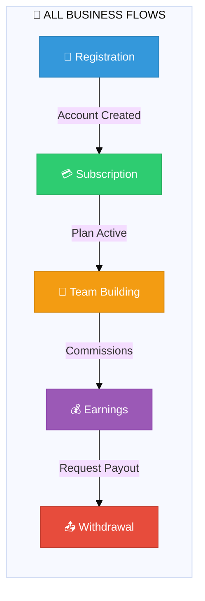
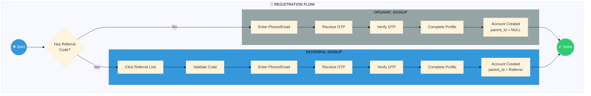
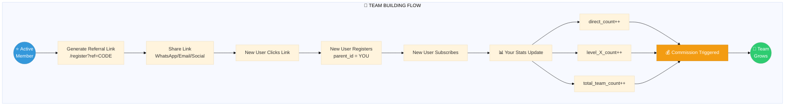
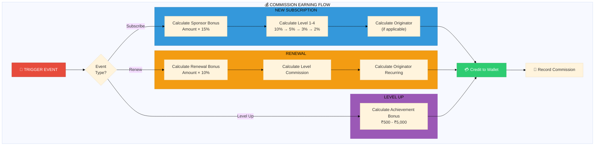
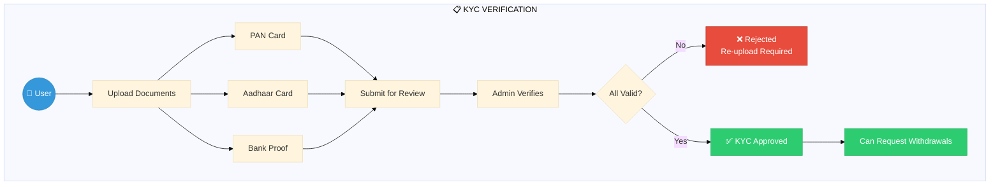
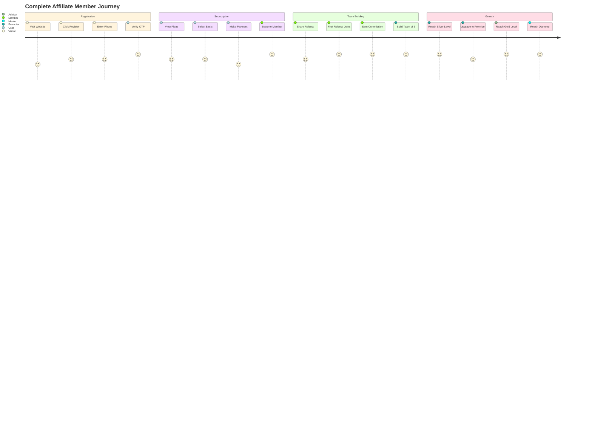

# Business Flows

<div align="center">

```
┌─────────────────────────────────────────────────────────────┐
│                    💼 BUSINESS FLOWS                        │
│         Core Operations • User Journeys • Processes         │
└─────────────────────────────────────────────────────────────┘
```

**[← Affiliate](../affiliate/INDEX.md)** • **[Hub](../README.md)** • **[Admin →](../admin/INDEX.md)**

</div>

---

## Flow Overview



---

## 1. Registration Flow



### Registration Data Flow

```
INPUT                    PROCESS                      OUTPUT
━━━━━━━━━━━━━━━━━━━━━━━━━━━━━━━━━━━━━━━━━━━━━━━━━━━━━━━━━━━━━━

Phone/Email ──────────► OtpManager.generate() ──────► OTP Sent
                             │
                             ▼
OTP Code ─────────────► OtpManager.verify() ───────► Valid/Invalid
                             │
                             ▼
Profile Data ─────────► User::create() ────────────► User Record
                             │
                             ▼
Referral Code ────────► Set parent_id ─────────────► Affiliate Link Created
(optional)
```

---

## 2. Subscription Flow

```mermaid
%%{init: {'theme': 'base'}}%%

flowchart TB
    subgraph SUB["💳 SUBSCRIPTION FLOW"]
        S1(("👤 User<br/>Logged In"))

        S2["View Plans<br/>Basic/Premium/Elite/Royal"]

        S3["Select Plan"]

        S4["Review Pricing<br/>Base + GST (18%)"]

        S5{"Has<br/>Originator?"}

        S6A["Create Subscription<br/>originator_id = NULL"]
        S6B["Create Subscription<br/>originator_id = Advisor"]

        S7["Redirect to<br/>Payment Gateway"]

        S8{"Payment<br/>Success?"}

        S9A["❌ Payment Failed<br/>Retry or Cancel"]

        S9B["✅ Activate Subscription"]

        S10["Process Commissions<br/>(if has sponsor)"]

        S11["Create Genealogy Record"]

        DONE(("✅ Member<br/>Active"))

        S1 --> S2 --> S3 --> S4 --> S5
        S5 -->|"No"| S6A --> S7
        S5 -->|"Yes"| S6B --> S7
        S7 --> S8
        S8 -->|"No"| S9A
        S8 -->|"Yes"| S9B --> S10 --> S11 --> DONE
    end

    style S1 fill:#3498db,stroke:#2980b9,color:#fff
    style DONE fill:#2ecc71,stroke:#27ae60,color:#fff
    style S9A fill:#e74c3c,stroke:#c0392b,color:#fff
    style S9B fill:#2ecc71,stroke:#27ae60,color:#fff
```



### Subscription Pricing Table

| Stage | Price (incl. GST) | Base | GST (18%) | PV |
|-------|-------------------|------|-----------|-----|
| **Basic** | **₹250** | ₹211.86 | ₹38.14 | 25 |
| **Premium** | **₹500** | ₹423.73 | ₹76.27 | 50 |
| **Elite** | **₹1,000** | ₹847.46 | ₹152.54 | 100 |

```
GST CALCULATION (18% inclusive):
━━━━━━━━━━━━━━━━━━━━━━━━━━━━━━━━━
Total Price = Base + GST
₹250 = Base + (Base × 0.18)
₹250 = Base × 1.18
Base = ₹250 ÷ 1.18 = ₹211.86
GST = ₹250 - ₹211.86 = ₹38.14

Note: Digital subscription GST is fixed at 18%
      (unlike e-commerce products with varying rates)
```

---

## 3. Team Building Flow



### Team Growth Visualization

```
YOUR TEAM GROWTH OVER TIME
━━━━━━━━━━━━━━━━━━━━━━━━━━━━━━━━━━━━━━━━━━━━

Month 1:  YOU ─┬─ A
              └─ B
              Direct: 2, Team: 2

Month 2:  YOU ─┬─ A ─┬─ C
              │     └─ D
              └─ B ─── E
              Direct: 2, Team: 5

Month 3:  YOU ─┬─ A ─┬─ C ─┬─ F
              │     │     └─ G
              │     └─ D ─── H
              └─ B ─── E ─── I
              Direct: 2, Team: 9

... continues exponentially (5^n potential)
```

---

## 4. Commission Earning Flow



---

## 5. Withdrawal Flow

```mermaid
%%{init: {'theme': 'base'}}%%

flowchart TB
    subgraph WD["📤 WITHDRAWAL FLOW"]
        W1(("💰 Has<br/>Balance"))

        W2{"KYC<br/>Verified?"}

        W3A["❌ Complete KYC First"]

        W3B["Request Withdrawal"]

        W4["Enter Amount"]

        W5{"Amount ><br/>Min (₹500)?"}

        W6A["❌ Below Minimum"]

        W6B["Check TDS Requirement"]

        W7{"Annual ><br/>₹10,000?"}

        W8A["No TDS Deduction"]
        W8B["TDS = 5% Deducted"]

        W9["Submit to Admin Queue"]

        W10["Admin Reviews"]

        W11{"Approved?"}

        W12A["❌ Rejected<br/>Balance Restored"]

        W12B["✅ Process Payout"]

        W13["Bank Transfer / UPI"]

        DONE(("✅ Received"))

        W1 --> W2
        W2 -->|"No"| W3A
        W2 -->|"Yes"| W3B --> W4 --> W5
        W5 -->|"No"| W6A
        W5 -->|"Yes"| W6B --> W7
        W7 -->|"No"| W8A --> W9
        W7 -->|"Yes"| W8B --> W9
        W9 --> W10 --> W11
        W11 -->|"No"| W12A
        W11 -->|"Yes"| W12B --> W13 --> DONE
    end

    style W1 fill:#f39c12,stroke:#d68910,color:#fff
    style DONE fill:#2ecc71,stroke:#27ae60,color:#fff
    style W3A fill:#e74c3c,stroke:#c0392b,color:#fff
    style W6A fill:#e74c3c,stroke:#c0392b,color:#fff
    style W12A fill:#e74c3c,stroke:#c0392b,color:#fff
    style W12B fill:#2ecc71,stroke:#27ae60,color:#fff
```



### Withdrawal Calculation Example

```
WITHDRAWAL REQUEST: ₹15,000
━━━━━━━━━━━━━━━━━━━━━━━━━━━━━━━━━━━━━━━━━━━━

Step 1: Check KYC
        ✓ PAN Card verified
        ✓ Bank account verified

Step 2: Check Minimum
        ₹15,000 >= ₹500 ✓

Step 3: Check TDS
        Annual earnings: ₹45,000
        ₹45,000 > ₹10,000 → TDS applicable

Step 4: Calculate
        Gross:    ₹15,000
        TDS (5%): -₹750
        ─────────────────
        Net:      ₹14,250

Step 5: Admin Approval → Bank Transfer
```

---

## 6. KYC Verification Flow



---

## Complete User Journey (End-to-End)



---

## Navigation

| Previous | Up | Next |
|----------|----|----|
| [🌳 Affiliate](../affiliate/INDEX.md) | [🏠 Hub](../README.md) | [🛡️ Admin](../admin/INDEX.md) |

---

<div align="center">

**[Registration](./registration.md)** • **[Subscription](./subscription.md)** • **[Payment](./payment.md)** • **[Withdrawal](./withdrawal.md)** • **[KYC](./kyc.md)**

</div>
