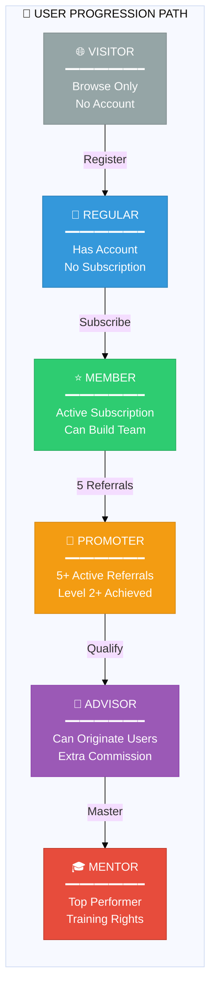
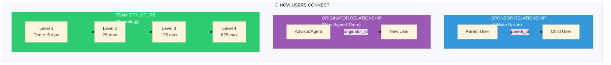
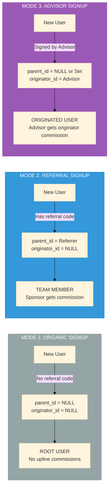

# User Ecosystem

<div align="center">

```
┌─────────────────────────────────────────────────────────────┐
│                    👥 USER ECOSYSTEM                        │
│         All user types and their interconnections           │
└─────────────────────────────────────────────────────────────┘
```

**[← Back to Hub](../README.md)** • **[Affiliate →](../affiliate/INDEX.md)** • **[Flows →](../flows/INDEX.md)**

</div>

---

## User Type Hierarchy



---

## User Types Comparison

| Type | Icon | Access | Affiliate | Earnings | Requirements |
|------|------|--------|-----|----------|--------------|
| **Visitor** | 🌐 | Public pages only | ❌ | ❌ | None |
| **Regular** | 👤 | Dashboard (limited) | ❌ | ❌ | Registration |
| **Member** | ⭐ | Full dashboard | ✅ | ✅ | Subscription |
| **Promoter** | 🚀 | + Team tools | ✅ | ✅✅ | 5+ active referrals |
| **Advisor** | 💼 | + Origination | ✅ | ✅✅✅ | Special qualification |
| **Mentor** | 🎓 | + Training | ✅ | ✅✅✅✅ | Top performer status |

---

## User Connections Map



---

## Key Concepts

### Sponsor vs Originator

| Aspect | Sponsor (parent_id) | Originator (originator_id) |
|--------|--------------------|-----------------------------|
| **Who** | Affiliate upline member | Advisor who signed them up |
| **Relationship** | Team/genealogy tree | Business acquisition |
| **Commission** | Sponsor bonus, level commission | Originator joining/recurring |
| **Can be same?** | Yes, advisor can be own sponsor | Yes |
| **Can be null?** | Yes (root user) | Yes (organic signup) |

### User Registration Modes



---

## Individual User Journeys

<table>
<tr>
<td width="50%">

### [👤 Regular User Journey](./regular.md)
- Registration process
- Account setup
- Dashboard access
- Upgrade path

</td>
<td width="50%">

### [⭐ Member Journey](./member.md)
- Subscription selection
- Payment process
- Team building
- Earning starts

</td>
</tr>
<tr>
<td>

### [🚀 Promoter Journey](./promoter.md)
- Qualification criteria
- Enhanced features
- Higher commissions
- Team management

</td>
<td>

### [💼 Advisor Journey](./advisor.md)
- Originator capabilities
- Special commission types
- User acquisition
- Business building

</td>
</tr>
</table>

---

## Navigation

| Previous | Up | Next |
|----------|----|----|
| - | [🏠 Hub](../README.md) | [🌳 Affiliate](../affiliate/INDEX.md) |

---

<div align="center">

**[👤 Regular](./regular.md)** • **[⭐ Member](./member.md)** • **[🚀 Promoter](./promoter.md)** • **[💼 Advisor](./advisor.md)** • **[🎓 Mentor](./mentor.md)**

</div>
