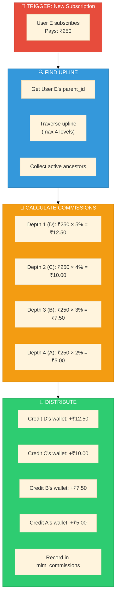

# MLM Commission Calculation - Complete Blueprint

<div align="center">

```
┌─────────────────────────────────────────────────────────────┐
│            💰 COMMISSION CALCULATION BLUEPRINT              │
│         Complete Formula • P&L Analysis • Scenarios         │
└─────────────────────────────────────────────────────────────┘
```

**[← MLM Index](./INDEX.md)** • **[Hub](../README.md)**

</div>

---

## System Overview

```
COMMERINITY PRO - MLM COMMISSION SYSTEM
━━━━━━━━━━━━━━━━━━━━━━━━━━━━━━━━━━━━━━━━━━━━━━━━━━━━━━━━━━━━━━━━━━━━━━━━━━━

Matrix Type:        5-Width × 4-Depth (per stage)
Levels per Stage:   4 (Bronze → Silver → Gold → Diamond)
Level 5:            Stage Upgrade (optional bonus, P&L dependent)

Entry Point:        User subscribes → Joins at Level 1 (Starter/Bronze)
Commission Trigger: Each new subscription pays commissions to upline
```

---

## Level Structure (Per Stage)

```
LEVEL STRUCTURE
━━━━━━━━━━━━━━━━━━━━━━━━━━━━━━━━━━━━━━━━━━━━━━━━━━━━━━━━━━━━━━━━━━━━━━━━━━━

┌─────────┬────────────┬──────────────────┬────────────────────────────────┐
│ Level   │ Name       │ Team Capacity    │ Requirement to Reach           │
│         │            │ (descendants)    │                                │
├─────────┼────────────┼──────────────────┼────────────────────────────────┤
│ Level 1 │ Bronze     │ 5                │ Subscribe (instant)            │
│ Level 2 │ Silver     │ 25               │ Have 5+ descendants            │
│ Level 3 │ Gold       │ 125              │ Have 25+ descendants           │
│ Level 4 │ Diamond    │ 625              │ Have 125+ descendants          │
├─────────┼────────────┼──────────────────┼────────────────────────────────┤
│ Level 5 │ [UPGRADE]  │ -                │ Have 625+ → Next Stage         │
└─────────┴────────────┴──────────────────┴────────────────────────────────┘

Team Capacity Formula: 5^level_number
├── Level 1: 5^1 = 5
├── Level 2: 5^2 = 25
├── Level 3: 5^3 = 125
└── Level 4: 5^4 = 625

Total Max Team: 5 + 25 + 125 + 625 = 780 members per stage
```

---

## Commission Formula

### Master Formula

```
┌─────────────────────────────────────────────────────────────────────────┐
│                                                                         │
│   LEVEL COMMISSION FORMULA                                              │
│   ═══════════════════════════════════════════════════════════════════   │
│                                                                         │
│   commission = stage_subscription_cost × (level_commission_percent/100) │
│                                                                         │
│   WHERE:                                                                │
│   ├── stage_subscription_cost = Stage.price (e.g., ₹250)               │
│   ├── level_commission_percent = Level.depth_commission (e.g., 5%)     │
│   └── Each parent at depth N gets commission based on their depth      │
│                                                                         │
└─────────────────────────────────────────────────────────────────────────┘
```

### Commission Rates (Admin Configurable via DB)

```
COMMISSION RATES PER DEPTH
━━━━━━━━━━━━━━━━━━━━━━━━━━━━━━━━━━━━━━━━━━━━━━━━━━━━━━━━━━━━━━━━━━━━━━━━━━━

When NEW USER subscribes (pays ₹250):
Commissions go to PARENTS (upline) based on their DEPTH from new user:

┌───────────────┬────────────┬─────────────────────────────────────────────┐
│ Parent Depth  │ Commission │ Calculation                                 │
│ (from new)    │ Rate       │ (Stage Cost = ₹250)                         │
├───────────────┼────────────┼─────────────────────────────────────────────┤
│ Depth 1       │ 5%         │ ₹250 × 5% = ₹12.50                         │
│ (Direct)      │            │                                             │
├───────────────┼────────────┼─────────────────────────────────────────────┤
│ Depth 2       │ 4%         │ ₹250 × 4% = ₹10.00                         │
├───────────────┼────────────┼─────────────────────────────────────────────┤
│ Depth 3       │ 3%         │ ₹250 × 3% = ₹7.50                          │
├───────────────┼────────────┼─────────────────────────────────────────────┤
│ Depth 4       │ 2%         │ ₹250 × 2% = ₹5.00                          │
├───────────────┼────────────┼─────────────────────────────────────────────┤
│ TOTAL PAYOUT  │ 14%        │ ₹250 × 14% = ₹35.00                        │
└───────────────┴────────────┴─────────────────────────────────────────────┘

Note: "Depth" = How many levels UP from the new user
      "Level" = User's own rank (Bronze/Silver/Gold/Diamond)
```

---

## Visual: Commission Flow

```
COMMISSION FLOW WHEN USER E JOINS
━━━━━━━━━━━━━━━━━━━━━━━━━━━━━━━━━━━━━━━━━━━━━━━━━━━━━━━━━━━━━━━━━━━━━━━━━━━

                    User A (Level: Gold)
                    Depth 4 from E
                    Gets: ₹250 × 2% = ₹5.00
                         │
                    User B (Level: Silver)
                    Depth 3 from E
                    Gets: ₹250 × 3% = ₹7.50
                         │
                    User C (Level: Silver)
                    Depth 2 from E
                    Gets: ₹250 × 4% = ₹10.00
                         │
                    User D (Level: Bronze)
                    Depth 1 from E (Direct Sponsor)
                    Gets: ₹250 × 5% = ₹12.50
                         │
                    User E (NEW) ←──── Pays ₹250 subscription
                    Joins at Level 1 (Bronze)


TOTAL COMMISSION DISTRIBUTED: ₹35.00 (14% of ₹250)
COMPANY RETAINS: ₹215.00 (86% of ₹250)
```

---

## Mermaid Flowchart



---

## Profit & Loss Analysis

### Scenario 1: Single Stage (₹250 Entry)

```
P&L ANALYSIS - SINGLE SUBSCRIPTION
━━━━━━━━━━━━━━━━━━━━━━━━━━━━━━━━━━━━━━━━━━━━━━━━━━━━━━━━━━━━━━━━━━━━━━━━━━━

INCOME (per subscription):
├── Subscription Fee:                     ₹250.00
└── TOTAL INCOME:                         ₹250.00

COMMISSION PAYOUT:
├── Depth 1 (5%):                         ₹12.50
├── Depth 2 (4%):                         ₹10.00
├── Depth 3 (3%):                         ₹7.50
├── Depth 4 (2%):                         ₹5.00
└── TOTAL PAYOUT:                         ₹35.00 (14%)

COMPANY GROSS MARGIN:
├── Income:                               ₹250.00
├── Commission Payout:                    -₹35.00
└── GROSS MARGIN:                         ₹215.00 (86%)

OTHER COSTS (estimated):
├── Payment Gateway (2%):                 ₹5.00
├── Server/Infra (1%):                    ₹2.50
├── Support/Ops (3%):                     ₹7.50
└── TOTAL OTHER COSTS:                    ₹15.00 (6%)

NET MARGIN:
├── Gross Margin:                         ₹215.00
├── Other Costs:                          -₹15.00
└── NET PROFIT:                           ₹200.00 (80%)

✅ VERDICT: HIGHLY PROFITABLE at 14% commission payout
```

### Scenario 2: What if Level 5 gets 1%?

```
P&L ANALYSIS - WITH LEVEL 5 BONUS (1%)
━━━━━━━━━━━━━━━━━━━━━━━━━━━━━━━━━━━━━━━━━━━━━━━━━━━━━━━━━━━━━━━━━━━━━━━━━━━

COMMISSION PAYOUT (with Level 5):
├── Depth 1 (5%):                         ₹12.50
├── Depth 2 (4%):                         ₹10.00
├── Depth 3 (3%):                         ₹7.50
├── Depth 4 (2%):                         ₹5.00
├── Depth 5 (1%):                         ₹2.50  ← NEW
└── TOTAL PAYOUT:                         ₹37.50 (15%)

COMPANY GROSS MARGIN:
├── Income:                               ₹250.00
├── Commission Payout:                    -₹37.50
└── GROSS MARGIN:                         ₹212.50 (85%)

✅ VERDICT: Still highly profitable
   Only 1% additional cost for Stage Upgrade incentive
```

### Scenario 3: Full Team Commission (Max Payout)

```
WORST CASE: WHAT IF ALL 4 UPLINE LEVELS EXIST?
━━━━━━━━━━━━━━━━━━━━━━━━━━━━━━━━━━━━━━━━━━━━━━━━━━━━━━━━━━━━━━━━━━━━━━━━━━━

For EVERY new subscription:
├── Max Commission: 5% + 4% + 3% + 2% = 14%
├── This is FIXED regardless of team size
└── Company always keeps 86%

WHY THIS IS SUSTAINABLE:
├── Early users (no upline): Company keeps 100%
├── Users with 1 upline: Company keeps 95%
├── Users with 2 upline: Company keeps 91%
├── Users with 3 upline: Company keeps 88%
├── Users with 4 upline: Company keeps 86%
└── NEVER less than 86% (capped at 4 levels)

AVERAGE PAYOUT (estimated):
├── 30% users have 0-1 upline: ~2.5% avg payout
├── 40% users have 2 upline: ~9% avg payout
├── 20% users have 3 upline: ~12% avg payout
├── 10% users have 4 upline: ~14% avg payout
└── WEIGHTED AVERAGE: ~8% actual payout
   (Company keeps ~92% on average!)
```

---

## Stage Comparison

```
STAGE PRICING & COMMISSION COMPARISON
━━━━━━━━━━━━━━━━━━━━━━━━━━━━━━━━━━━━━━━━━━━━━━━━━━━━━━━━━━━━━━━━━━━━━━━━━━━

┌─────────┬───────────┬────────────────────────────────────────────────────┐
│ Stage   │ Price     │ Commission per Depth (same % different ₹)         │
│         │           │ D1(5%)    D2(4%)    D3(3%)    D4(2%)    Total     │
├─────────┼───────────┼────────────────────────────────────────────────────┤
│ Basic   │ ₹250      │ ₹12.50   ₹10.00   ₹7.50    ₹5.00    ₹35.00     │
│ Premium │ ₹500      │ ₹25.00   ₹20.00   ₹15.00   ₹10.00   ₹70.00     │
│ Elite   │ ₹1,000    │ ₹50.00   ₹40.00   ₹30.00   ₹20.00   ₹140.00    │
│ Royal   │ ₹2,500    │ ₹125.00  ₹100.00  ₹75.00   ₹50.00   ₹350.00    │
└─────────┴───────────┴────────────────────────────────────────────────────┘

KEY INSIGHT:
├── Higher stage = Higher absolute commission (same %)
├── Incentivizes upgrades
└── Company margin stays constant at 86%
```

---

## Database Schema (How it's Stored)

```
DATABASE CONFIGURATION
━━━━━━━━━━━━━━━━━━━━━━━━━━━━━━━━━━━━━━━━━━━━━━━━━━━━━━━━━━━━━━━━━━━━━━━━━━━

TABLE: stages
┌─────────────────────────────────────────────────────────────────────────┐
│ id │ name    │ price  │ commission_rates                               │
├────┼─────────┼────────┼────────────────────────────────────────────────┤
│ 1  │ Basic   │ 25000  │ {"level_1": 5, "level_2": 4, "level_3": 3,    │
│    │         │ (paisa)│  "level_4": 2}                                 │
├────┼─────────┼────────┼────────────────────────────────────────────────┤
│ 2  │ Premium │ 50000  │ {"level_1": 5, "level_2": 4, "level_3": 3,    │
│    │         │        │  "level_4": 2}                                 │
└────┴─────────┴────────┴────────────────────────────────────────────────┘

TABLE: levels
┌─────────────────────────────────────────────────────────────────────────┐
│ id │ stage_id │ name    │ level_number │ team_member_limit │ joining_  │
│    │          │         │              │                   │ bonus     │
├────┼──────────┼─────────┼──────────────┼───────────────────┼───────────┤
│ 1  │ 1        │ Bronze  │ 1            │ 5                 │ 0         │
│ 2  │ 1        │ Silver  │ 2            │ 25                │ 0         │
│ 3  │ 1        │ Gold    │ 3            │ 125               │ 0         │
│ 4  │ 1        │ Diamond │ 4            │ 625               │ 0         │
└────┴──────────┴─────────┴──────────────┴───────────────────┴───────────┘

ADMIN CAN MODIFY:
├── stage.price → Changes base for all calculations
├── stage.commission_rates → Change % per depth
└── level.joining_bonus → Achievement bonus (separate from depth commission)
```

---

## Formula Summary

```
┌─────────────────────────────────────────────────────────────────────────┐
│                                                                         │
│   MASTER FORMULAS                                                       │
│   ═══════════════════════════════════════════════════════════════════   │
│                                                                         │
│   1. LEVEL COMMISSION (per depth):                                      │
│      commission = stage.price × stage.commission_rates[depth] / 100     │
│                                                                         │
│   2. TOTAL COMMISSION PAYOUT:                                           │
│      total = Σ (commission for each active ancestor up to depth 4)      │
│                                                                         │
│   3. COMPANY MARGIN:                                                    │
│      margin = stage.price - total_commission_payout                     │
│      margin_percent = 100% - (5% + 4% + 3% + 2%) = 86%                 │
│                                                                         │
│   4. LEVEL QUALIFICATION:                                               │
│      can_promote = (user.descendants >= level.team_member_limit)        │
│      Level 1: 0 descendants (instant on subscribe)                      │
│      Level 2: 5+ descendants                                            │
│      Level 3: 25+ descendants                                           │
│      Level 4: 125+ descendants                                          │
│      Level 5: 625+ descendants → Stage Upgrade trigger                  │
│                                                                         │
│   5. OPTIONAL LEVEL 5 BONUS (if enabled):                               │
│      level_5_bonus = stage.price × 1% (P&L approved)                    │
│                                                                         │
└─────────────────────────────────────────────────────────────────────────┘
```

---

## Decision: Level 5 (1%) - Should We Include?

```
LEVEL 5 ANALYSIS (Stage Upgrade Bonus)
━━━━━━━━━━━━━━━━━━━━━━━━━━━━━━━━━━━━━━━━━━━━━━━━━━━━━━━━━━━━━━━━━━━━━━━━━━━

PROS:
├── ✅ Incentivizes building larger teams
├── ✅ Only 1% additional cost
├── ✅ Triggers stage upgrade excitement
├── ✅ Creates milestone celebration

CONS:
├── ⚠️ Adds complexity
├── ⚠️ Rare occurrence (625+ descendants is hard)
├── ⚠️ May not be meaningful for most users

RECOMMENDATION:
├── OPTION A: Skip Level 5 bonus (keep simple)
│   └── Total payout: 14% (current)
│
├── OPTION B: Include Level 5 at 1%
│   └── Total payout: 15% (still safe)
│
└── OPTION C: Make it admin-configurable (default: 0%)
    └── Admin can enable/set % later

SUGGESTED: Option C (configurable, default off)
```

---

## Navigation

| Previous | Up | Next |
|----------|----|----|
| [MLM Index](./INDEX.md) | [🏠 Hub](../README.md) | [Stages](./stages.md) |

---

<div align="center">

*All formulas are admin-configurable via database*
*Commission rates can be adjusted without code changes*

</div>
