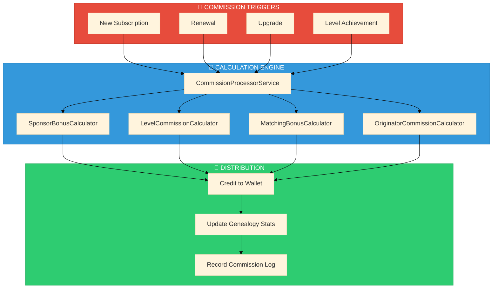
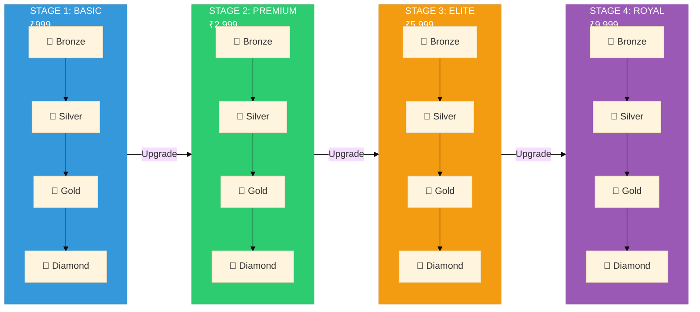
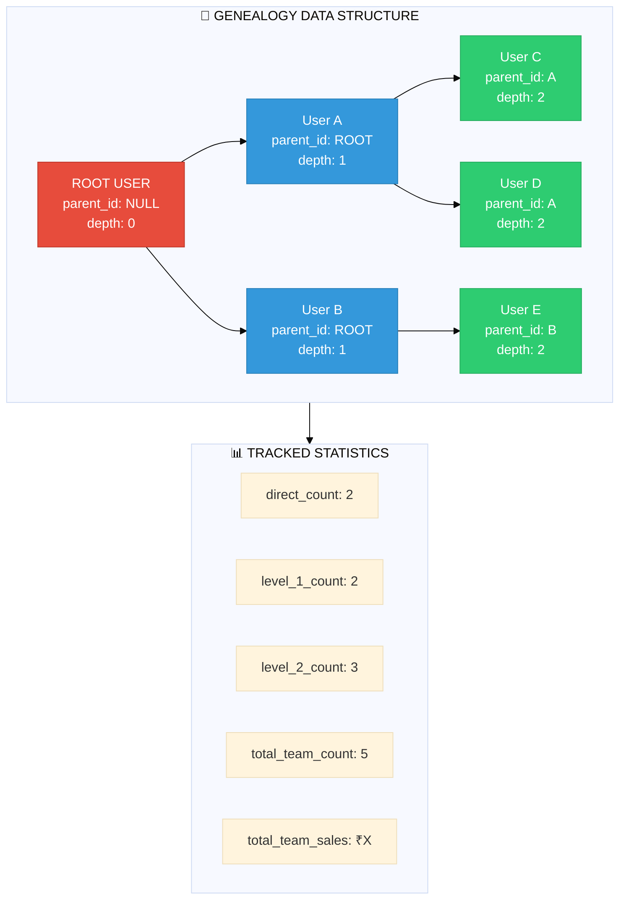

# MLM Blueprint

<div align="center">

```
┌─────────────────────────────────────────────────────────────┐
│                    🌳 MLM BLUEPRINT                         │
│      Matrix Structure • Commissions • Calculations          │
└─────────────────────────────────────────────────────────────┘
```

**[← Users](../users/INDEX.md)** • **[Hub](../README.md)** • **[Flows →](../flows/INDEX.md)**

</div>

---

## Quick Navigation

| Document | Description | Status |
|----------|-------------|--------|
| **[Current System](./CURRENT-SYSTEM.md)** | What we built - complete documentation | ✅ Implemented |
| **[Proposed System](./PROPOSED-SYSTEM.md)** | New formula analysis | 📋 Proposal |
| **[System Comparison](./SYSTEM-COMPARISON.md)** | Side-by-side comparison with P&L | 📊 Analysis |
| **[Simulation](./SIMULATION.md)** | Full simulations with 780 user journey | 🧮 Calculator |
| **[Commission Calculation](./COMMISSION-CALCULATION.md)** | Detailed formulas & scenarios | 📐 Reference |

### Key Findings

- **System A (Current)**: 35% max payout (Sponsor 15% + Level 10%+5%+3%+2%)
- **System B (Proposed)**: 14% max payout (Level 5%+4%+3%+2%, no sponsor bonus)
- **Structural Difference**: System A has separate sponsor bonus, System B doesn't
- **System Flexibility**: ✅ 100% configurable via database - [See Part 9](./SIMULATION.md#part-9-system-flexibility-analysis)

---

## 5×4 Matrix Structure

```mermaid
%%{init: {'theme': 'base', 'themeVariables': { 'fontSize': '14px'}}}%%

flowchart TB
    subgraph MATRIX["🌳 5×4 MATRIX VISUALIZATION"]
        YOU["🧑 YOU<br/>━━━━━━━━"]

        subgraph L1["LEVEL 1 — Direct Referrals (Max: 5)"]
            L1A["👤"] & L1B["👤"] & L1C["👤"] & L1D["👤"] & L1E["👤"]
        end

        subgraph L2["LEVEL 2 — (Max: 25 = 5×5)"]
            L2A["👤👤👤👤👤"] & L2B["👤👤👤👤👤"] & L2C["👤👤👤👤👤"] & L2D["👤👤👤👤👤"] & L2E["👤👤👤👤👤"]
        end

        subgraph L3["LEVEL 3 — (Max: 125 = 5×25)"]
            L3A["25 members each branch = 125 total"]
        end

        subgraph L4["LEVEL 4 — (Max: 625 = 5×125)"]
            L4A["125 members each branch = 625 total"]
        end

        YOU --> L1
        L1 --> L2
        L2 --> L3
        L3 --> L4
    end

    style YOU fill:#e74c3c,stroke:#c0392b,color:#fff
    style L1 fill:#3498db,stroke:#2980b9,color:#fff
    style L2 fill:#2ecc71,stroke:#27ae60,color:#fff
    style L3 fill:#f39c12,stroke:#d68910,color:#fff
    style L4 fill:#9b59b6,stroke:#8e44ad,color:#fff
```



### Matrix Capacity Table

| Level | Width | Capacity | Cumulative | Commission % |
|-------|-------|----------|------------|--------------|
| **L1** | 5 | 5 | 5 | 5% |
| **L2** | 5² | 25 | 30 | 4% |
| **L3** | 5³ | 125 | 155 | 3% |
| **L4** | 5⁴ | 625 | **780** | 2% |

```
📊 MAX TEAM = 5 + 25 + 125 + 625 = 780 members
```

---

## Commission Types & Calculations

### Quick Formula Reference

```
┌─────────────────────────────────────────────────────────────────────────┐
│                    💰 COMMISSION FORMULAS                               │
├─────────────────────────────────────────────────────────────────────────┤
│                                                                         │
│  LEVEL 1 COMMISSION    = Subscription Amount × 5%                       │
│  (Direct Sponsor)      = ₹250 × 0.05 = ₹12.50                          │
│                                                                         │
│  LEVEL 2 COMMISSION    = Subscription Amount × 4%                       │
│                        = ₹250 × 0.04 = ₹10.00                          │
│                                                                         │
│  LEVEL 3 COMMISSION    = Subscription Amount × 3%                       │
│                        = ₹250 × 0.03 = ₹7.50                           │
│                                                                         │
│  LEVEL 4 COMMISSION    = Subscription Amount × 2%                       │
│                        = ₹250 × 0.02 = ₹5.00                           │
│                                                                         │
│  TOTAL MLM PAYOUT      = 5% + 4% + 3% + 2% = 14% MAX                   │
│                                                                         │
│  ORIGINATOR JOINING    = First Subscription × 5%                        │
│  (Advisor Commission)  = ₹250 × 0.05 = ₹12.50                          │
│                                                                         │
│  TOTAL MAX PAYOUT      = 14% MLM + 5% Originator = 19%                 │
│                                                                         │
│  TDS DEDUCTION         = Total Earnings × 10% (if > ₹10,000/year)      │
│                                                                         │
└─────────────────────────────────────────────────────────────────────────┘
```

### Commission Flow Diagram



---

## Commission Calculation Examples

### Example 1: New Member Joins (₹999 Basic Plan)

```
SCENARIO: User B joins under User A (Sponsor)
━━━━━━━━━━━━━━━━━━━━━━━━━━━━━━━━━━━━━━━━━━━━━━━━

User A (Sponsor) receives:
├── Sponsor Bonus    = ₹999 × 15% = ₹149.85
└── Level 1 Comm     = ₹999 × 10% = ₹99.90
                       ─────────────────────
                       TOTAL      = ₹249.75

If User A has upline (User Z):
├── User Z (L2)      = ₹999 × 5%  = ₹49.95
└── User Z's upline  = ₹999 × 3%  = ₹29.97 (L3)
                       ... continues to L4
```

### Example 2: Full 4-Level Commission Flow

```
SCENARIO: User E joins, team structure:
━━━━━━━━━━━━━━━━━━━━━━━━━━━━━━━━━━━━━━━━━━━━━━━━

           User A (L4 from E)
              │
           User B (L3 from E)
              │
           User C (L2 from E)
              │
           User D (L1 from E, Sponsor)
              │
           User E (NEW MEMBER) ← Pays ₹999

COMMISSION DISTRIBUTION:
┌────────┬─────────┬───────┬─────────────┐
│ User   │ Level   │ Rate  │ Amount      │
├────────┼─────────┼───────┼─────────────┤
│ D      │ Sponsor │ 15%   │ ₹149.85     │
│ D      │ L1      │ 10%   │ ₹99.90      │
│ C      │ L2      │ 5%    │ ₹49.95      │
│ B      │ L3      │ 3%    │ ₹29.97      │
│ A      │ L4      │ 2%    │ ₹19.98      │
├────────┼─────────┼───────┼─────────────┤
│ TOTAL  │         │ 35%   │ ₹349.65     │
└────────┴─────────┴───────┴─────────────┘
```

### Example 3: Originator Commission (Advisor Signs User)

```
SCENARIO: Advisor X signs up User Y (may or may not have MLM sponsor)
━━━━━━━━━━━━━━━━━━━━━━━━━━━━━━━━━━━━━━━━━━━━━━━━━━━━━━━━━━━━━━━━━━━━━

User Y subscription: ₹2,999 (Premium Plan)

Advisor X receives:
├── Originator Joining Commission = ₹2,999 × 10% = ₹299.90
│   (One-time for first subscription)
│
└── Future: Originator Recurring  = Renewal × 5%
    (On every renewal by User Y)

NOTE: This is SEPARATE from MLM commissions.
      User Y's MLM sponsor (if any) ALSO gets sponsor/level commissions.
```

---

## Stage & Level Progression

### 4 Stages × 4 Levels = 16 Total Ranks



### Level Requirements

| Level | Direct Referrals | Active Directs | Team Limit | Achievement Bonus |
|-------|------------------|----------------|------------|-------------------|
| 🥉 **Bronze** | 1 | 1 | 5 | ₹500 |
| 🥈 **Silver** | 2 | 1 | 25 | ₹1,000 |
| 🥇 **Gold** | 3 | 2 | 125 | ₹2,000 |
| 💎 **Diamond** | 4 | 3 | 625 | ₹5,000 |

### Level Progression Formula

```
QUALIFICATION CHECK:
━━━━━━━━━━━━━━━━━━━━━━━━━━━━━━━━━━━━━━━━━━━━━━━━

Can promote to Level N if:
├── direct_referrals >= min_direct_referrals[N]
├── active_directs >= min_active_directs[N]
├── team_size <= team_member_limit[N]
└── subscription is ACTIVE

Example: Promote to Silver (Level 2)
├── direct_referrals >= 2  ✓
├── active_directs >= 1    ✓
├── team_size <= 25        ✓
└── status = 'active'      ✓
    ─────────────────────────
    PROMOTED! + ₹1,000 bonus
```

---

## Genealogy Tree Structure



---

## TDS Deduction Rules

```
TAX DEDUCTED AT SOURCE (TDS) - India Regulations
━━━━━━━━━━━━━━━━━━━━━━━━━━━━━━━━━━━━━━━━━━━━━━━━

IF annual_earnings > ₹10,000:
    TDS = earnings × 5%

APPLIED ON:
├── Withdrawal requests
└── Commission payouts

EXAMPLE:
├── Total Earnings: ₹50,000
├── TDS (5%): ₹2,500
└── Net Payout: ₹47,500
```

---

## Navigation

| Previous | Up | Next |
|----------|----|----|
| [👥 Users](../users/INDEX.md) | [🏠 Hub](../README.md) | [💼 Flows](../flows/INDEX.md) |

---

<div align="center">

**[Matrix](./matrix.md)** • **[Stages](./stages.md)** • **[Levels](./levels.md)** • **[Commissions](./commissions.md)** • **[Genealogy](./genealogy.md)**

</div>
