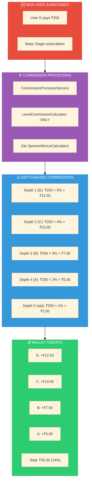
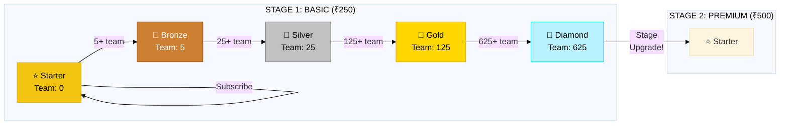

# Proposed System - New Formula

<div align="center">

```
┌─────────────────────────────────────────────────────────────────────────┐
│                                                                         │
│                    📐 PROPOSED SYSTEM                                   │
│                                                                         │
│              New Commission Formula Analysis                            │
│                    December 2024                                        │
│                                                                         │
└─────────────────────────────────────────────────────────────────────────┘
```

**[← Current System](./CURRENT-SYSTEM.md)** • **[MLM Index](./INDEX.md)** • **[Comparison →](./SYSTEM-COMPARISON.md)**

</div>

---

## 1. Proposed Changes Overview

```
PROPOSED CHANGES SUMMARY
━━━━━━━━━━━━━━━━━━━━━━━━━━━━━━━━━━━━━━━━━━━━━━━━━━━━━━━━━━━━━━━━━━━━━━━━━━━

CHANGES FROM CURRENT:
├── ❌ REMOVE: Sponsor Bonus (15%)
├── ✏️ MODIFY: Level Commission Rates
├── ✏️ MODIFY: Stage Pricing (lower entry)
├── ➕ ADD: Level 5 option (Stage Upgrade trigger)
└── ➕ ADD: 5-Level structure (start from 0)

NEW FORMULA:
commission = stage_price × commission_rate_percent
(No separate sponsor bonus - simplified)
```

---

## 2. Proposed Stage Pricing

```
PROPOSED STAGE PRICING
━━━━━━━━━━━━━━━━━━━━━━━━━━━━━━━━━━━━━━━━━━━━━━━━━━━━━━━━━━━━━━━━━━━━━━━━━━━

┌──────────┬─────────────┬────────────────────────────────────────────────┐
│ Stage    │ Price       │ Notes                                          │
├──────────┼─────────────┼────────────────────────────────────────────────┤
│ Basic    │ ₹250        │ Entry level - user becomes member              │
│ Premium  │ ₹500        │ Shows in wallet for upgrade                    │
│ Elite    │ ₹1,000      │ Shows in wallet for upgrade                    │
│ Royal    │ ₹2,500      │ Shows in wallet for upgrade                    │
└──────────┴─────────────┴────────────────────────────────────────────────┘

COMPARED TO CURRENT:
├── Basic:   ₹999 → ₹250   (75% reduction)
├── Premium: ₹2,999 → ₹500   (83% reduction)
├── Elite:   ₹5,999 → ₹1,000 (83% reduction)
└── Royal:   ₹9,999 → ₹2,500 (75% reduction)

RATIONALE:
├── Lower entry barrier = More users can join
├── Focus on team building, not high ticket sales
└── Commission % stays same, absolute amount lower
```

---

## 3. Proposed Level Structure (5 Levels)

```
PROPOSED LEVEL STRUCTURE
━━━━━━━━━━━━━━━━━━━━━━━━━━━━━━━━━━━━━━━━━━━━━━━━━━━━━━━━━━━━━━━━━━━━━━━━━━━

┌─────────┬──────────┬───────────────┬─────────────────────────────────────┐
│ Level # │ Name     │ Min Team      │ Requirement                         │
│         │          │ (descendants) │                                     │
├─────────┼──────────┼───────────────┼─────────────────────────────────────┤
│ 1       │ Starter  │ 0             │ Just subscribe (instant)            │
│ 2       │ Bronze   │ 5             │ Have 5+ team members                │
│ 3       │ Silver   │ 25            │ Have 25+ team members               │
│ 4       │ Gold     │ 125           │ Have 125+ team members              │
│ 5       │ Diamond  │ 625           │ Have 625+ → Stage Upgrade!          │
└─────────┴──────────┴───────────────┴─────────────────────────────────────┘

FORMULA: min_team = 5^(level-1)
├── Level 1: 5^0 = 1 → 0 (entry point)
├── Level 2: 5^1 = 5
├── Level 3: 5^2 = 25
├── Level 4: 5^3 = 125
└── Level 5: 5^4 = 625

COMPARED TO CURRENT:
├── Current: 4 levels, start from 5 team members
├── Proposed: 5 levels, start from 0 (immediate Level 1)
└── Benefit: User feels accomplished immediately
```

---

## 4. Proposed Commission Rates

```
PROPOSED COMMISSION RATES
━━━━━━━━━━━━━━━━━━━━━━━━━━━━━━━━━━━━━━━━━━━━━━━━━━━━━━━━━━━━━━━━━━━━━━━━━━━

When new user subscribes, PARENTS get commission based on DEPTH:

┌───────────────┬────────────┬───────────────────────────────────────────┐
│ Parent Depth  │ Commission │ Team Capacity at that Level               │
│ (from new)    │ Rate       │                                           │
├───────────────┼────────────┼───────────────────────────────────────────┤
│ Depth 1       │ 5%         │ Level 1 capacity: 5                       │
│ (Direct)      │            │                                           │
├───────────────┼────────────┼───────────────────────────────────────────┤
│ Depth 2       │ 4%         │ Level 2 capacity: 25                      │
├───────────────┼────────────┼───────────────────────────────────────────┤
│ Depth 3       │ 3%         │ Level 3 capacity: 125                     │
├───────────────┼────────────┼───────────────────────────────────────────┤
│ Depth 4       │ 2%         │ Level 4 capacity: 625                     │
├───────────────┼────────────┼───────────────────────────────────────────┤
│ Depth 5       │ 1%         │ Optional - Stage Upgrade trigger          │
│ (Optional)    │            │                                           │
├───────────────┼────────────┼───────────────────────────────────────────┤
│ TOTAL         │ 14-15%     │                                           │
└───────────────┴────────────┴───────────────────────────────────────────┘

NO SPONSOR BONUS - Only depth-based commission!
```

---

## 5. Visual Flow Diagrams

### 5.1 Commission Flow - Proposed System



### 5.2 Proposed Team Tree Visualization

```
PROPOSED SYSTEM - COMMISSION DISTRIBUTION
━━━━━━━━━━━━━━━━━━━━━━━━━━━━━━━━━━━━━━━━━━━━━━━━━━━━━━━━━━━━━━━━━━━━━━━━━━━

When User E subscribes for ₹250:

┌─────────────────────────────────────────────────────────────────────────┐
│                                                                         │
│                         User A                                          │
│                    ┌─────────────┐                                      │
│                    │ 🥇 Gold     │                                      │
│                    │ Depth 4     │                                      │
│                    │ ─────────── │                                      │
│                    │ Gets: ₹5.00 │                                      │
│                    │ (2%)        │                                      │
│                    └──────┬──────┘                                      │
│                           │                                             │
│                         User B                                          │
│                    ┌─────────────┐                                      │
│                    │ 🥈 Silver   │                                      │
│                    │ Depth 3     │                                      │
│                    │ ─────────── │                                      │
│                    │ Gets: ₹7.50 │                                      │
│                    │ (3%)        │                                      │
│                    └──────┬──────┘                                      │
│                           │                                             │
│                         User C                                          │
│                    ┌─────────────┐                                      │
│                    │ 🥉 Bronze   │                                      │
│                    │ Depth 2     │                                      │
│                    │ ─────────── │                                      │
│                    │ Gets: ₹10.00│                                      │
│                    │ (4%)        │                                      │
│                    └──────┬──────┘                                      │
│                           │                                             │
│                         User D                                          │
│                    ┌─────────────┐                                      │
│                    │ ⭐ Starter  │                                      │
│                    │ Depth 1     │                                      │
│                    │ DIRECT      │                                      │
│                    │ ─────────── │                                      │
│                    │ Gets: ₹12.50│                                      │
│                    │ (5%)        │                                      │
│                    │             │                                      │
│                    │ NO SPONSOR  │                                      │
│                    │ BONUS!      │                                      │
│                    └──────┬──────┘                                      │
│                           │                                             │
│                    ┌──────▼──────┐                                      │
│                    │ 🆕 User E   │                                      │
│                    │ NEW MEMBER  │                                      │
│                    │ ═══════════ │                                      │
│                    │ PAYS: ₹250  │                                      │
│                    │ Joins:      │                                      │
│                    │ Starter L1  │                                      │
│                    └─────────────┘                                      │
│                                                                         │
└─────────────────────────────────────────────────────────────────────────┘
```

### 5.3 Proposed Level Progression



---

## 6. Commission Summary - Proposed

```
PROPOSED SYSTEM - COMMISSION SUMMARY
━━━━━━━━━━━━━━━━━━━━━━━━━━━━━━━━━━━━━━━━━━━━━━━━━━━━━━━━━━━━━━━━━━━━━━━━━━━

┌────────────────────────┬────────────┬──────────────────────────────────┐
│ Commission Type        │ Rate       │ Calculation (₹250 base)          │
├────────────────────────┼────────────┼──────────────────────────────────┤
│ Sponsor Bonus          │ 0%         │ REMOVED                          │
│ Depth 1                │ 5%         │ ₹250 × 0.05 = ₹12.50            │
│ Depth 2                │ 4%         │ ₹250 × 0.04 = ₹10.00            │
│ Depth 3                │ 3%         │ ₹250 × 0.03 = ₹7.50             │
│ Depth 4                │ 2%         │ ₹250 × 0.02 = ₹5.00             │
│ Depth 5 (optional)     │ 1%         │ ₹250 × 0.01 = ₹2.50             │
├────────────────────────┼────────────┼──────────────────────────────────┤
│ TOTAL PAYOUT           │ 14-15%     │ ₹35.00 - ₹37.50                 │
│ COMPANY KEEPS          │ 85-86%     │ ₹212.50 - ₹215.00               │
├────────────────────────┼────────────┼──────────────────────────────────┤
│ Direct Sponsor Gets    │ 5%         │ ₹12.50 only                      │
└────────────────────────┴────────────┴──────────────────────────────────┘
```

---

## 7. P&L Analysis - Proposed System

```
PROFIT & LOSS - PROPOSED SYSTEM
━━━━━━━━━━━━━━━━━━━━━━━━━━━━━━━━━━━━━━━━━━━━━━━━━━━━━━━━━━━━━━━━━━━━━━━━━━━

PER SUBSCRIPTION (₹250 - Full 4-level upline):

REVENUE:
├── Subscription:                              ₹250.00

COMMISSION EXPENSES:
├── Depth 1 Commission (5%):                   -₹12.50
├── Depth 2 Commission (4%):                   -₹10.00
├── Depth 3 Commission (3%):                   -₹7.50
├── Depth 4 Commission (2%):                   -₹5.00
├── ─────────────────────────────────────────────────────
├── TOTAL COMMISSION:                          -₹35.00 (14%)

GROSS MARGIN:
├── Revenue - Commission:                      ₹215.00 (86%)

OPERATING COSTS (Estimated % same):
├── Payment Gateway (2%):                      -₹5.00
├── Server/Infrastructure (2%):                -₹5.00
├── Support/Operations (3%):                   -₹7.50
├── Marketing (5%):                            -₹12.50
├── ─────────────────────────────────────────────────────
├── TOTAL OPERATING:                           -₹30.00 (12%)

NET PROFIT:
├── Gross Margin - Operating:                  ₹185.00 (74%)

┌─────────────────────────────────────────────────────────────────────────┐
│                                                                         │
│   NET PROFIT MARGIN: 74% (₹185.00 per ₹250 subscription)               │
│                                                                         │
│   ✅ HIGHLY SUSTAINABLE - Higher margin, more room for growth          │
│                                                                         │
└─────────────────────────────────────────────────────────────────────────┘
```

---

## 8. Simulation: 100 Users

```
100 USER SIMULATION - PROPOSED SYSTEM
━━━━━━━━━━━━━━━━━━━━━━━━━━━━━━━━━━━━━━━━━━━━━━━━━━━━━━━━━━━━━━━━━━━━━━━━━━━

Distribution:
├── 10 users: 0 upline (root users)
├── 25 users: 1 level upline
├── 30 users: 2 levels upline
├── 20 users: 3 levels upline
└── 15 users: 4 levels upline

Total Revenue: 100 × ₹250 = ₹25,000

COMMISSION CALCULATION:

10 Root Users (0 upline):
├── Payout: ₹0 × 10 = ₹0
└── Company: ₹250 × 10 = ₹2,500 (100%)

25 Users (1 upline - 5%):
├── Payout: ₹12.50 × 25 = ₹312.50
└── Company: ₹237.50 × 25 = ₹5,937.50 (95%)

30 Users (2 uplines - 9%):
├── Payout: ₹22.50 × 30 = ₹675.00
└── Company: ₹227.50 × 30 = ₹6,825.00 (91%)

20 Users (3 uplines - 12%):
├── Payout: ₹30.00 × 20 = ₹600.00
└── Company: ₹220.00 × 20 = ₹4,400.00 (88%)

15 Users (4 uplines - 14%):
├── Payout: ₹35.00 × 15 = ₹525.00
└── Company: ₹215.00 × 15 = ₹3,225.00 (86%)

┌─────────────────────────────────────────────────────────────────────────┐
│ PROPOSED SYSTEM TOTALS (100 Users × ₹250)                               │
├─────────────────────────────────────────────────────────────────────────┤
│ Total Revenue:           ₹25,000.00                                     │
│ Total Commission Payout: ₹2,112.50 (8.45%)                              │
│ Company Gross Margin:    ₹22,887.50 (91.55%)                            │
└─────────────────────────────────────────────────────────────────────────┘
```

---

## 9. Code Changes Required

```
REQUIRED CODE CHANGES FOR PROPOSED SYSTEM
━━━━━━━━━━━━━━━━━━━━━━━━━━━━━━━━━━━━━━━━━━━━━━━━━━━━━━━━━━━━━━━━━━━━━━━━━━━

1. STAGE MODEL / FACTORY:
   ├── Update base_price values (₹250, ₹500, ₹1000, ₹2500)
   ├── Update commission_rates: {level_1: 5, level_2: 4, level_3: 3, level_4: 2}
   ├── Update sponsor_bonus: {type: 'percent', value: 0}  // or remove
   └── Add level_5 to commission_rates if needed

2. LEVEL MODEL / FACTORY:
   ├── Change team_member_limit formula: 5^(level-1) instead of 5^level
   ├── Add Level 5 (Diamond → Stage Upgrade trigger)
   └── Update min requirements for 5 levels

3. CALCULATORS:
   ├── SponsorBonusCalculator: Disable or set to 0%
   ├── LevelCommissionCalculator: Update maxDepth to 5
   └── Add Level5Calculator (optional for stage upgrade bonus)

4. TESTS:
   └── Update MlmJourneyTest to reflect new rates

5. MIGRATIONS:
   └── Update existing stage/level data
```

---

## 10. Pros & Cons

```
PROPOSED SYSTEM - PROS & CONS
━━━━━━━━━━━━━━━━━━━━━━━━━━━━━━━━━━━━━━━━━━━━━━━━━━━━━━━━━━━━━━━━━━━━━━━━━━━

✅ PROS:
┌─────────────────────────────────────────────────────────────────────────┐
│ 1. HIGHLY SUSTAINABLE (86% margin)                                      │
│    └── Much more profit for company growth                              │
│                                                                         │
│ 2. LOWER ENTRY BARRIER (₹250)                                           │
│    └── More users can afford to join                                    │
│                                                                         │
│ 3. SIMPLER CALCULATION                                                  │
│    └── Only depth-based, no sponsor bonus confusion                     │
│                                                                         │
│ 4. 5 LEVELS WITH INSTANT START                                          │
│    └── User is Level 1 immediately - feels rewarding                    │
│                                                                         │
│ 5. STAGE UPGRADE PATH (Level 5)                                         │
│    └── Clear progression goal at 625 team members                       │
│                                                                         │
│ 6. EVEN DISTRIBUTION                                                    │
│    └── 5%, 4%, 3%, 2% is more balanced than 25% to direct               │
└─────────────────────────────────────────────────────────────────────────┘

❌ CONS:
┌─────────────────────────────────────────────────────────────────────────┐
│ 1. LOWER USER ATTRACTION                                                │
│    └── ₹12.50 per referral is not very exciting                         │
│                                                                         │
│ 2. SLOW ROI FOR USERS                                                   │
│    └── Need 20 referrals to recover ₹250 subscription                   │
│                                                                         │
│ 3. LESS COMPETITIVE                                                     │
│    └── Other MLMs offer 30-40% payout                                   │
│                                                                         │
│ 4. WEAK DIRECT SPONSOR INCENTIVE                                        │
│    └── No sponsor bonus may reduce recruitment drive                    │
│                                                                         │
│ 5. LOWER ABSOLUTE EARNINGS                                              │
│    └── Even with same %, lower price = lower ₹                          │
└─────────────────────────────────────────────────────────────────────────┘
```

---

## Navigation

| Previous | Up | Next |
|----------|----|----|
| [Current System](./CURRENT-SYSTEM.md) | [MLM Index](./INDEX.md) | [Comparison](./SYSTEM-COMPARISON.md) |

---

<div align="center">

**Status: PROPOSAL ONLY**
<br>
*Not Yet Implemented*
<br>
*December 2024*

</div>
