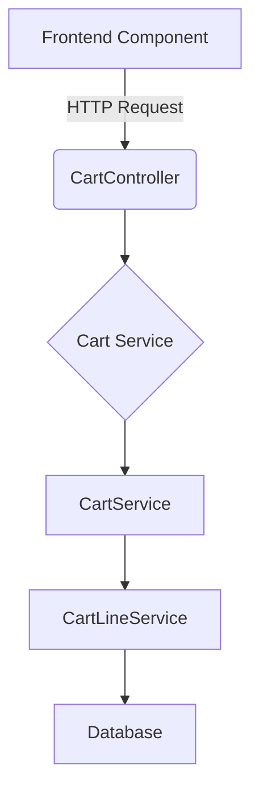

# Laravel Commerinity Package Documentation

This document provides a comprehensive guide to the `laravel-commerinity` package, a core component of the Commerinity e-commerce platform. It is intended for developers who want to understand, use, and extend the package's functionality.

## 1. Overview

The `laravel-commerinity` package provides the fundamental e-commerce features, including a robust shopping cart system, voucher and coupon management, and customer management.

## 2. Core Features

-   **Shopping Cart System**: A flexible cart system that supports both authenticated and guest users.
-   **Voucher System**: A system for creating and validating discount vouchers and coupons.
-   **Customer Management**: Basic customer management functionalities.

## 3. Shopping Cart System

The shopping cart system is the most complex and feature-rich part of this package.

### 3.1. Architecture

The cart system is built with a layered architecture to ensure a clear separation of concerns.

**Flow Chart:**

1.  **Frontend Component**: A Vue component in the Nuxt.js frontend (e.g., `AddToCartButton.vue`).
2.  **`CartController`**: The entry point for all HTTP requests related to the cart.
3.  **`Cart` Service**: Responsible for generating structured cart data (metadata) for API responses.
4.  **`CartService`**: The base service that contains the core business logic for cart operations.
5.  **`CartLineService`**: Handles the calculations for each individual line item in the cart.
6.  **Database**: The `carts` and other related tables in the database.

### 3.2. Core Components (Backend)

-   **`CartController`**: `app/Http/Controllers/Api/CartController.php`
-   **`Cart` Service**: `packages/mintreu/laravel-commerinity/src/Services/CartService/Cart.php`
-   **`CartService`**: `packages/mintreu/laravel-commerinity/src/Services/CartService/CartService.php`
-   **`CartLineService`**: `packages/mintreu/laravel-commerinity/src/Services/CartService/CartLineService.php`

### 3.3. Database Models

-   **`Cart`**: `App\Models\Cart.php` - Represents a single item in the cart.
-   **`VoucherCode`**: `Mintreu\LaravelCommerinity\Models\VoucherCode.php` - Represents a voucher or coupon code.

### 3.4. Frontend Integration

The frontend of the application is a Nuxt.js project located in the `frontend` directory. The cart functionality is primarily managed by the `useCart` composable and several Vue components.

**`useCart` Composable (`frontend/composables/useCart.ts`)**

This is the central piece of the cart functionality on the frontend. It provides:

-   **State Management**: Manages the cart state using `useState`.
-   **API Interaction**: Provides methods to interact with the backend cart API (`fetchCart`, `addToCart`, `updateCartItem`, `removeItem`, `applyCoupon`, `clearCart`, `mergeGuestCart`).
-   **Guest User Handling**: Manages guest user credentials (stores them in cookies and sends them in request headers).
-   **Error Handling**: Implements robust error handling and retry logic.

**Vue Components (`frontend/components/cart/` and `frontend/components/store/`)**

-   **`AddToCartButton.vue`**: A simple button to add a product to the cart.
-   **`CartCounter.vue`**: Displays the number of items in the cart.
-   **`GuestCartForm.vue`**: A form for guest users to enter their details during checkout.
-   **`AddToCartWithQuantitySelector.vue`**: A more advanced component with a quantity selector.

**Frontend to Backend Mapping**

| Frontend Action | `useCart` Method | HTTP Request | Backend Controller Method |
| --- | --- | --- | --- |
| Add item to cart | `addToCart` | `POST /api/cart/add/{sku}` | `addProduct` |
| Update item quantity | `updateCartItem` | `POST /api/cart/update/{sku}` | `updateProduct` |
| Remove item from cart | `removeItem` | `DELETE /api/cart/remove/{sku}` | `removeProduct` |
| View cart | `fetchCart` | `GET /api/cart` | `index` |
| Apply coupon | `applyCoupon` | `POST /api/cart/coupon/{code}` | `applyCoupon` |
| Clear cart | `clearCart` | `POST /api/cart/clear` | `clearCart` |
| Get guest credentials | `ensureGuestCredentials` | `POST /api/cart/guest-credential` | `ensureGuestCartCredential` |
| Validate guest credentials | `validateGuestCredential` | `POST /api/cart/validate/guest-credential` | `validateGuestCartCredential` |
| Merge guest cart | `mergeGuestCart` | `POST /api/cart/merge` | `mergeGuestCart` |

## 4. Voucher System

The voucher system allows the creation and validation of discount codes.

-   **`VoucherCode` Model**: Stores the voucher codes and their properties.
-   **`HasVoucherCodeValidator` Trait**: Provides the validation logic for the vouchers.
-   **`applyCoupon` API Endpoint**: Allows users to apply a voucher to their cart.

## 5. Installation and Configuration

This package is installed as a local path repository in the main `composer.json` file.

**Configuration File**: `config/laravel-commerinity.php`

This file contains various configuration options for the package, including:

-   Cart settings (e.g., guest user header names, token TTL).
-   Voucher settings.
